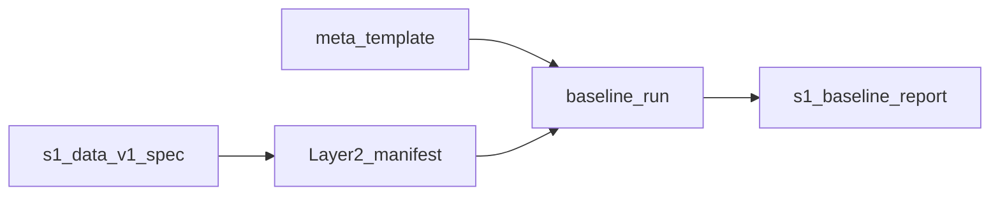

# Sprint 1 第一周规划（数据与基线）

## 范围与依据

- **Sprint 来源**：[execution/sprint-1-train.md](execution/sprint-1-train.md) 中「Week 1：数据与基线准备」及交付物 `s1-data-v1.0-spec`、`s1-baseline-report`。
- **数据配方对齐**：[shaping/7_data_CN.md](shaping/7_data_CN.md) 第 7.3 节（13.5k 配比：英文脑暴 5k + 中文脑暴 5k + 通用混合 3k + 种子 500）。
- **回归集定义**：[shaping/9_eval_qa_CN.md](shaping/9_eval_qa_CN.md) 第 9.1.3 节 Layer 2（约 500 条：核心脑暴约 200 + 通用保底约 200 + 中文保护约 100）。
- **实验命名与元数据**：[shaping/8_train_iterate_CN.md](shaping/8_train_iterate_CN.md) 第 8.2 节（命名格式、`experiment/` 下 README + META 等实践）。
- **环境与运维自检**：[shaping/10_infra_ops_CN.md](shaping/10_infra_ops_CN.md)（HF、GPU、依赖、可复现记录习惯）。

## 本周目标（一句话）

在**不开始 LoRA 训练**的前提下，完成 **数据 v1.0 可追溯冻结说明**、**实验元数据模板**、**基座 Gemma-4-E2B-IT 在 Layer 2 上的完整基线一次**，使 Week2 PoC 能直接引用同一数据版本与同一评估协议。

## 时间预算（20h）

假定 **5 个工作日 × 4h**；若你一周只有 3 个学习日，可将「第 4–5 天」合并为两个 8h 块。

| 天 | 时长 | 焦点 |
|----|------|------|
| D1 | 4h | 通读数据与评估 shaping；定稿 v1.0「冻结粒度」与 `s1-data-v1.0-spec` 大纲 |
| D2 | 4h | 数据目录/命名、追溯字段（HF revision / 子集规则 / 哈希或行 ID）；META 模板字段表 |
| D3 | 4h | Layer 2 清单化（500 条 ID、分层标签）；基线推理协议（模板、温度、max tokens） |
| D4 | 4h | 环境冒烟：基座权重可加载；Layer2 小样本推理与落盘格式验证 |
| D5 | 4h | 跑满 Layer 2；撰写 `s1-baseline-report`；定稿 spec；周回顾与 Week2 输入清单 |

## 交付物（与 execution 一致）

1. **`s1-data-v1.0-spec`（文档）**  
   - 配方表（与 7.3 一致）、各子集来源与版本指针、切分/抽样规则、已知缺口与补救计划。  
   - 明确「冻结」含义：至少包含**可复现指针**（例如数据集 revision、脚本 commit、随机种子、输出文件校验和之一组合）。

2. **`s1-baseline-report`（报告）**  
   - 基座：`Gemma-4-E2B-IT`（与 Sprint 主线一致）。  
   - 评估集：Layer 2 全量；输出按子层（核心 / 通用 / 中文）分层汇总。  
   - 附录：原始输出路径、运行环境摘要、是否触碰 P0/P1 红线的占位说明（红线定义见 [shaping/9_eval_qa_CN.md](shaping/9_eval_qa_CN.md) 后续章节）。

3. **实验元数据模板**  
   - 对齐 [shaping/8_train_iterate_CN.md](shaping/8_train_iterate_CN.md) 8.2.3：实验 ID、父实验、数据版本、基座模型、评估集版本、配置摘要、结论、产物路径。  
   - 建议首条实例为 baseline 实验（例如 `baseline-gemma4e2b-it-layer2-v0`），证明模板可落地。

## 本周 Definition of Done

- 仅凭 `s1-data-v1.0-spec` 能回答：**训练数据 v1.0 由哪些块组成、各块如何追溯到具体快照**。  
- Layer 2 **500 条可逐条定位**（唯一 ID + 来源）。  
- **整份 Layer 2** 对基座跑通一遍，结果结构化落盘；`s1-baseline-report` 可读且可交给 Week2 对比。  
- **不做**：PoC 训练、Stage 1、Android 接入（避免范围膨胀，与 Week1 定义一致）。

## 风险与降级

- **中文翻译子集未齐**：在 spec 中标为「v1.0-a」或分块冻结；Week2 PoC 可先用英文子集 + 通用保底，但须在 spec 写明 Gate1 前必须补齐的块。  
- **Layer 2 未凑满 500**：优先保证 **分层结构** 与 **可复跑脚本**；条数可暂少，但须在报告中标注「非最终 Layer2」，并计划补全周。  
- **GPU/时间不够跑满 500**：先完成子层各 50 条分层基线 + 全量跑通计划；避免无协议地减半导致后续对比失效。

## 与 Gate1 的前置关系

Week1 直接支撑 [execution/sprint-1-train.md](execution/sprint-1-train.md) 中 Gate1 的「评估可复跑」与「数据版本冻结」；**训练可复现**与 **LoRA 可加载** 将在 Week2–4 验证，本周不强行验收。

## 可选落盘位置（确认计划后由你或 Agent 执行）

仓库尚无 `sprint-1-week1` 专文件时，可将 spec / report 放在 `log/` 或新建 `execution/sprint-1/` 子目录；命名与 [shaping/8_train_iterate_CN.md](shaping/8_train_iterate_CN.md) 的实验目录约定保持一致即可。
