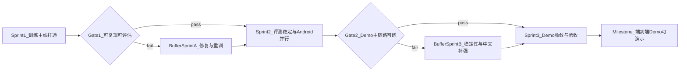

# 三个月 Sprint 执行计划

## 目标与约束

- 三个月主目标：跑通端到端流程，并交付可演示的 Android Demo。
- 模型主线：`Gemma-4-E2B`，仅在中文质量未达最低可用时启用 `Qwen3.5-2B` 备选分支。
- 资源约束：每周约 20 小时；优先保守迭代，避免并行过多实验。
- 质量策略：先可用再优化；三个月内不强制推进 Stage 2 个性化微调。

## 文档基线（沿用）

- 用户与场景基线：[d:\yichao\LLM\llm-fine-tunning-project\shaping\3_user_background_shaping_CN.md](d:\yichao\LLM\llm-fine-tunning-project\shaping\3_user_background_shaping_CN.md)
- 模型与数据基线：[d:\yichao\LLM\llm-fine-tunning-project\shaping\6_model_strategy_CN.md](d:\yichao\LLM\llm-fine-tunning-project\shaping\6_model_strategy_CN.md)、[d:\yichao\LLM\llm-fine-tunning-project\shaping\7_data_CN.md](d:\yichao\LLM\llm-fine-tunning-project\shaping\7_data_CN.md)
- 训练与实验基线：[d:\yichao\LLM\llm-fine-tunning-project\shaping\8_train_iterate_CN.md](d:\yichao\LLM\llm-fine-tunning-project\shaping\8_train_iterate_CN.md)
- 评测与质量基线：[d:\yichao\LLM\llm-fine-tunning-project\shaping\9_eval_qa_CN.md](d:\yichao\LLM\llm-fine-tunning-project\shaping\9_eval_qa_CN.md)
- 基础设施与运维基线：[d:\yichao\LLM\llm-fine-tunning-project\shaping\10_infra_ops_CN.md](d:\yichao\LLM\llm-fine-tunning-project\shaping\10_infra_ops_CN.md)

## Sprint 节奏与门禁

- 每个 Sprint 末固定输出：结果报告、下一 Sprint 输入清单、风险与阻塞。
- 任一阶段触发 P0/P1 红线时，立即转入缓冲 Sprint 处理，不叠加新目标。

## Sprint 1（第 1 个月）训练主线打通

- 目标：完成 `Gemma-4-E2B` 的 PoC 与 Stage 1 基础微调闭环。
- 必做：
  - 冻结数据版本（`v1.0`）并记录实验元数据规范。
  - 至少完成 1 次 PoC + 1 次 Stage 1 训练。
  - 跑通 Layer 2 回归评估并产出首份对比报告。
  - 确认实验命名与 lineage 记录机制在实践中可用。
- 产出物：
  - 1 个可加载 LoRA 权重候选。
  - 1 份基线 vs 微调结果报告（含是否触发红线）。
  - 1 份 Sprint 复盘（失败样本、下一步修正点）。
- Gate1 通过标准：
  - 训练可复现、评估可复跑、模型可加载推理。
  - 核心能力至少达到“可用不退化”。

## Sprint 2（第 2 个月）评测稳定 + Android 并行接入

- 目标：建立稳定评测节奏，并打通 Android 最小可用主路径。
- 必做：
  - 固化训练后自动回归流程（以 Layer 2 为主）。
  - 完成 1-2 轮保守微调迭代（优先修正已知弱点）。
  - Android 侧接入模型推理能力，完成最小主链路：随手记 -> 头脑风暴 -> 卡片收成。
  - 对齐数据流与隐私开关行为（仅做可用实现，不追求完整运营化）。
- 产出物：
  - Android Demo v0（可演示最小主流程）。
  - 评测稳定版报告（包含中文保护题表现）。
  - 已知问题清单（性能、质量、异常输入）。
- Gate2 通过标准：
  - Demo 主链路在真实设备可跑通。
  - 评测未触发 P0/P1 红线。

## Sprint 3（第 3 个月）Demo 收敛与验收

- 目标：形成可演示、可复盘、可继续迭代的里程碑版本。
- 必做：
  - 聚焦稳定性：崩溃、超时、空输入/超长输入等边界问题。
  - 聚焦体验：输出结构化一致性、中文可读性、基础响应速度。
  - 完成 Layer 3 人工验收集走查并形成验收结论。
  - 归档版本：模型版本、评测结果、风险清单、后续 backlog。
- 产出物：
  - Android Demo v1（端到端可演示）。
  - 里程碑验收报告（通过/有条件通过/不通过）。
  - 下一阶段路线图（是否引入 Qwen 分支、是否进入 Stage 2）。
- 里程碑完成标准：
  - 你可以稳定演示完整流程并复现实验结果。
  - 团队可基于现有文档继续推进而不依赖“口头记忆”。

## 缓冲 Sprint 规则（可后延 1-2 个）

- BufferSprintA（训练修复）：
  - 只做数据配方修正、评测回归、红线清理。
  - 不引入新功能与新模型主线。
- BufferSprintB（Demo 稳定）：
  - 只做稳定性与中文质量补强。
  - 不扩展 Stage 2、不扩展多模态。

## 风险与止损

- 中文质量风险：若连续两个迭代周期“中文保护题”不可用，则触发 Qwen 备选评估（仅作为备选，不切主线）。
- 时间风险：若连续两周无法完成 Sprint 周目标，立即降级可选项，保留“必做项”。
- 成本风险：GPU 使用接近预算上限时，优先保留回归评估与 Demo 主链路，暂停广泛探索实验。

## 执行看板建议（每周）

- 必做（Must）：直接影响本 Sprint Gate 的任务。
- 可选（Should）：提升体验但不影响 Gate 通过。
- 不做（Won’t）：明确不在本 Sprint 处理，防止范围膨胀。

## Sprint 结束固定复盘模板

- 本 Sprint 目标是否达成（达成/部分达成/未达成）。
- 关键指标变化（核心能力、中文保护题、稳定性）。
- 主要阻塞与根因。
- 下 Sprint 保留项、删除项、新增项（仅 3-5 条）。