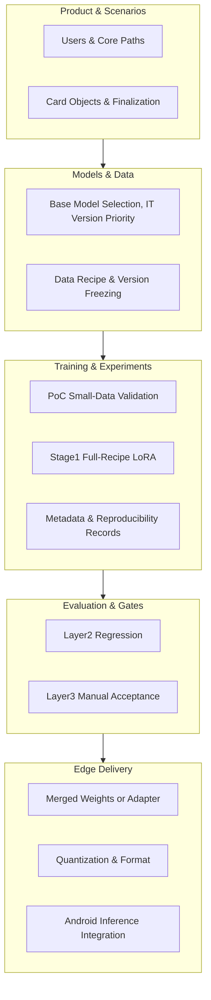

# 0. Overview: End-to-End Finetuning and Edge Deployment

> This document serves as the **entry point and roadmap** for the **shaping phase**, connecting objectives, constraints, chapter documentation, and **actionable finetuning steps** related to "small-parameter LLMs + mobile deployment" into a cohesive narrative. For detailed specifics, please refer to the numbered chapters. This document does not replace the original texts such as [6_model_strategy_CN.md](6_model_strategy_CN.md), [7_data_CN.md](7_data_CN.md), and [8_train_iterate_CN.md](8_train_iterate_CN.md).

---

## 0.1 Document Positioning and Recommended Reading Order

| Order | Document | What It Addresses |
|-------|----------|-------------------|
| 0 | **This Document** | Overview, step index, chapter navigation |
| 1 | [3_user_background_shaping_EN.md](3_user_background_shaping_EN.md) | Target users, usage scenarios, core paths for Quick Capture / Brainstorming |
| 2 | [4_object_rule_EN.md](4_object_rule_EN.md) | Inspiration cards, tags, associations, and finalization semantics |
| 3 | [5_surface_EN.md](5_surface_EN.md) | First version Kotlin Android, edge-cloud collaboration, placeholder for edge-side tech path |
| 4 | [6_model_strategy_EN.md](6_model_strategy_EN.md) | Small model inventory (Gemma 4 E2B/E4B, Qwen3.5, etc.), two-stage finetuning concepts |
| 5 | [7_data_EN.md](7_data_EN.md) | Data recipes, bilingual construction, evaluation benchmark strategies |
| 6 | [8_train_iterate_EN.md](8_train_iterate_EN.md) | PoC / Stage1 division, experiment naming, reproducibility |
| 7 | [9_eval_qa_EN.md](9_eval_qa_EN.md) | Layer1–3 question sets, quality redlines, and decision-making |
| 8 | [10_infra_ops_EN.md](10_infra_ops_EN.md) | Data flow, privacy switches, decoupling training from product |

**Relationship with Execution Layer**: Three-month cadence, Sprint gates, etc., are detailed in the repository's `.cursor/plans/` and `_docs/execution/` (e.g., `sprint-1-train.md`, data v1.0 spec, and baseline reports). Shaping defines "what to do and to what extent"; execution defines "what files to deliver this week".

---

## 0.2 One-Sentence Goal and Boundaries

- **Goal**: Run the core "Inspiration Product" workflow (Quick Capture, Brainstorming, Card Harvesting) on **Android phones** with **on-device inference as the primary mode**. On the model side, prioritize **2B–4B-class** small models (e.g., **Gemma-4-E2B / E4B-IT**, **Qwen3.5-2B / 0.8B**, etc.; smaller variants in the same family like Qwen3 can also be included for PoC comparison). Align the model's capabilities with "brainstorming dialogue + summary harvesting" through lightweight finetuning techniques such as **SFT + LoRA**, then deploy to the device via **quantization / format conversion**.
- **Boundaries (Shaping Consensus)**: The first version does not lock in the edge-side framework (selection among llama.cpp GGUF, ONNX Runtime, TFLite, etc., occurs during the implementation phase); **Stage 2 personalization** is treated as a separate placeholder and does not block the "make it usable first, then optimize" mainline.

---

## 0.3 End-to-End Overview (From Idea to Running on a Phone)

---

## 0.4 "What to Do at Each Step" — The Main Finetuning Path for Mobile Deployment

The following steps are arranged in **recommended order**. Deliverables at each step must smoothly transition to the next, avoiding incomparable or irreproducible results caused by "having weights but lacking protocols."

### Step 1: Freeze "What to Teach the Model"

- **What to do**: Refer to [3](3_user_background_shaping_CN.md) and [4](4_object_rule_CN.md), translating "multi-round brainstorming questioning/convergence" and "card harvesting required fields (title, body, tags, associations, source summary)" into trainable behavior descriptions (instruction style, output structure preferences).
- **Deliverable**: Scenario-level capability list (no coding required); aligned with product-facing use cases in [9](9_eval_qa_CN.md).

### Step 2: Select Base Models and Licenses

- **What to do**: Select 1–2 base models from the observation list in [6](6_model_strategy_CN.md) (e.g., the mainline **Gemma-4-E2B-IT**, with **Qwen3.5-2B** as an alternative if Chinese performance is insufficient); confirm licenses and commercial terms.
- **Deliverable**: "PoC base model" and "alternative base model" plus switching conditions (aligned with the Chinese risk contingency plan in the three-month plan).

### Step 3: Build and Freeze Training Data Version

- **What to do**: Prepare a mixed dataset according to the recipe in [7](7_data_CN.md) Section 7.3 (brainstorming English/Chinese, general safety net, seed data); record traceable information such as **HF revision / script commit / random seeds / output checksums** (see execution deliverables like `s1-data-v1.0-spec`).
- **Deliverable**: `Data version v1.x` + reproducibility notes; **Do not**: unversioned "temporary patchworks."

### Step 4: Prepare Evaluation Question Sets (Establish Protocol Before Large-Scale Training)

- **What to do**: Establish [9](9_eval_qa_CN.md)'s **Layer 2 (~500 items)** as the primary regression test set for each experiment; define **fixed decoding parameters** and write-to-disk formats; optional Layer 1 probes and Layer 3 acceptance checklists.
- **Deliverable**: **Baseline report** of the base model on Layer 2 (used to compare whether subsequent LoRA causes degradation).

### Step 5: Stage 0 — PoC (Small Data, Fast Iteration)

- **What to do**: Following [8](8_train_iterate_CN.md) 8.1.1, use a data subset (~1k scale) + **LoRA** to run 3–5 short experiments, verifying data format, training scripts, evaluation pipeline, and weight loadability.
- **Deliverable**: Evaluable LoRA files + first instance of metadata template (README + META, see 8.2.3).

### Step 6: Stage 1-A — Full-Recipe Conservative Finetuning

- **What to do**: Full 13.5k-scale recipe (see [7](7_data_CN.md) 7.3); adopt conservative hyperparameters (e.g., smaller learning rate, limited epochs, mixed general data to prevent forgetting); reserve only a few control experiments per base model to avoid parallel experiment explosion.
- **Deliverable**: Stage-1 candidate LoRA; **Layer 2 comparison report** (core brainstorming / general safety net / Chinese protection layers).

### Step 7: Quality Gates and Iteration Decisions

- **What to do**: Against the redlines and layered dimensions in [9](9_eval_qa_CN.md), decide to **accept**, **reject**, or **iterate**; if brainstorming gains are insufficient, consider [8](8_train_iterate_CN.md) 8.1.3 aggressive version and set a stop-loss threshold.
- **Deliverable**: Written conclusion (written into experiment META), clarifying next data version or next hyperparameter direction.

### Step 8: Edge-Facing Weights and Formats

- **What to do**: **Merge or package** base + LoRA into formats acceptable for edge-side runtime; perform **quantization** (INT4/INT8, etc.) and format conversion (GGUF / ONNX, etc., to be decided during implementation phase) per [5](5_surface_CN.md) 5.2; perform latency and memory self-tests on target chips.
- **Deliverable**: **Single versioned artifact** loadable on Android (aligned with experiment ID).

### Step 9: Android Integration and End-to-End Demo

- **What to do**: Minimum viable path "Quick Capture → Brainstorming → Card Harvesting" runs on a physical device (aligned with execution Sprint 2/3); align with privacy and data flow in [10](10_infra_ops_CN.md) (on-device by default, optional cloud LLM).

### Step 10: Acceptance and Archival

- **What to do**: Layer 3 manual walkthrough + stability and edge-case testing; archive model versions, evaluation results, and known issue lists for continuation into the next phase (multi-base comparison, Stage 2).

---

## 0.5 The "Small Models" You Care About and Their Mapping in Shaping

- **Gemma-4-E2B / E4B-IT**: Current shaping **P0 edge-computing direction** mainline, suitable for "getting end-to-end working first" and the tradeoff between edge-side size and latency.
- **Qwen3.5-2B / 0.8B (and smaller variants in the same family)**: **Chinese and licensing** advantages; 0.8B-class is more suitable for extreme on-device latency experiments, while 2B-class is more suitable for primary Chinese experience.
- **Selection Method**: Avoid premature locking; use **same data version + same Layer 2 protocol** for comparison, then determine the "single primary base model."

---

## 0.6 Chinese Versions and Other Files

- Chinese version of this document: [0_整体方案_端到端微调与端侧部署_CN.md](0_整体方案_端到端微调与端侧部署_CN.md)
- User and scenarios Chinese: [3_user_background_shaping_CN.md](3_user_background_shaping_CN.md)  
- If other chapters have files with the `_CN` suffix, they are companion documents with the same structure as the English versions, intended for domestic communication.

---

## 0.7 Revision Notes

- **Maintainer**: As shaping chapters are updated, periodically check that the "Reading Order" and links in this section remain valid.
- **Initial Intent**: Satisfy the need to "understand the big picture in one file + know which chapter to open next + not get lost in finetuning steps."
