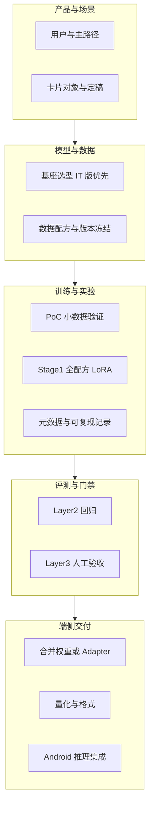

# 0. 整体方案：端到端微调与端侧部署（总览）

> 本文档是 **shaping 阶段** 的**入口与路线图**，将「小参数大模型 + 手机端部署」涉及的目标、约束、分章文档与**可执行的微调步骤**串联成一条主线。具体细节请参考各编号章节，本文档不替代 [6_model_strategy_CN.md](6_model_strategy_CN.md)、[7_data_CN.md](7_data_CN.md)、[8_train_iterate_CN.md](8_train_iterate_CN.md) 等原文。

---

## 0.1 文档定位与推荐阅读顺序

| 顺序 | 文档 | 解决什么问题 |
|------|------|----------------|
| 0 | **本文** | 全貌概览、步骤索引、章节导航 |
| 1 | [3_user_background_shaping_CN.md](3_user_background_shaping_CN.md) | 目标用户、使用场景、随手记 / 头脑风暴主路径 |
| 2 | [4_object_rule_CN.md](4_object_rule_CN.md) | 灵感卡片、标签、关联、定稿语义 |
| 3 | [5_surface_CN.md](5_surface_CN.md) | 首版 Kotlin Android、端云协同、端侧技术路径占位 |
| 4 | [6_model_strategy_CN.md](6_model_strategy_CN.md) | 小模型清单（Gemma 4 E2B/E4B、Qwen3.5 等）、两阶段微调概念 |
| 5 | [7_data_CN.md](7_data_CN.md) | 数据配方、双语构建、评估基准思路 |
| 6 | [8_train_iterate_CN.md](8_train_iterate_CN.md) | PoC / Stage1 划分、实验命名、可复现性 |
| 7 | [9_eval_qa_CN.md](9_eval_qa_CN.md) | Layer1–3 题集、质量红线与决策 |
| 8 | [10_infra_ops_CN.md](10_infra_ops_CN.md) | 数据流、隐私开关、训练与产品解耦 |

**与执行层的关系**：三个月节奏、Sprint 门禁等详见仓库 `.cursor/plans/` 与 `_docs/execution/`（如 `sprint-1-train.md`、数据 v1.0 规格与基线报告）。shaping 定义「做什么、做到什么程度」；execution 定义「本周交付什么文件」。

---

## 0.2 一句话目标与边界

- **目标**：在 **Android 手机** 上以**端侧推理为主**跑通「灵感产品」核心链路（随手记、头脑风暴、卡片收成）。模型侧优先使用 **2B–4B 级**小模型（如 **Gemma-4-E2B / E4B-IT**、**Qwen3.5-2B / 0.8B** 等；同族如 Qwen3 小尺寸亦可纳入 PoC 对比）。通过 **SFT + LoRA** 等轻量微调对齐「脑暴对话 + 总结收成」能力，再经 **量化 / 格式转换** 落到端上。
- **边界（shaping 共识）**：首版不锁定端侧框架（llama.cpp GGUF、ONNX Runtime、TFLite 等在实现阶段选型）；**Stage 2 个性化**单独占位，不阻塞「先可用再优化」的主线。

---

## 0.3 端到端总览（从想法到手机上可跑）

---

## 0.4 「每一步怎么做」—— 面向手机部署的微调主路径

以下步骤按**推荐顺序**排列，每步产出物需能顺利交接至下一步，避免因「仅有权重而缺乏协议」导致结果无法对比或复现。

### 步骤 1：冻结「要教模型什么」

- **做什么**：对照 [3](3_user_background_shaping_CN.md)、[4](4_object_rule_CN.md)，将「头脑风暴的多轮追问与收敛」「卡片收成所需字段（标题、正文、标签、关联、来源摘要）」转化为可训练的行为描述（指令风格、输出结构偏好）。
- **产出**：场景级能力清单（无需编码）；与 [9](9_eval_qa_CN.md) 中产品向用例保持一致即可。

### 步骤 2：选定基座与许可证

- **做什么**：在 [6](6_model_strategy_CN.md) 的观察清单中选定 1–2 个基座模型（如主线 **Gemma-4-E2B-IT**，中文表现不足时再评估 **Qwen3.5-2B**）；确认许可证与商用条款。
- **产出**：「PoC 基座」与「备选基座」及切换条件（与三个月计划中的中文风险预案一致）。

### 步骤 3：构建并冻结训练数据版本

- **做什么**：按 [7](7_data_CN.md) 第 7.3 节配方准备混合数据集（脑暴英文/中文、通用保底、种子数据）；记录 **HF revision / 脚本 commit / 随机种子 / 输出校验** 等可追溯信息（见 execution 中 `s1-data-v1.0-spec` 类交付物）。
- **产出**：`数据版本 v1.x` + 可复现说明；**不做**：无版本标识的「临时拼凑」。

### 步骤 4：准备评估题集（先于大规模训练跑通协议）

- **做什么**：确立 [9](9_eval_qa_CN.md) 的 **Layer 2（约 500 条）** 为每次实验后的回归测试主集；定义**固定解码参数**与落盘格式；可选 Layer 1 探针、Layer 3 验收清单。
- **产出**：基座模型在 Layer 2 上的**基线报告**（用于对比后续 LoRA 是否退化）。

### 步骤 5：阶段 0 — PoC（小数据、快循环）

- **做什么**：按 [8](8_train_iterate_CN.md) 8.1.1，使用数据子集（约 1k 规模）+ **LoRA** 跑 3–5 轮短实验，验证数据格式、训练脚本、评测管道、权重可加载。
- **产出**：可评估的 LoRA 文件 + 元数据模板首条实例（README + META，见 8.2.3）。

### 步骤 6：阶段 1-A — 全配方保守微调

- **做什么**：全量 13.5k 级配方（见 [7](7_data_CN.md) 7.3）；采用保守超参数（如较小学习率、有限 epoch、混合通用数据防遗忘）；每个基座保留少量对照实验即可，避免并行实验爆炸。
- **产出**：Stage-1 候选 LoRA；**Layer 2 对比报告**（核心脑暴 / 通用保底 / 中文保护分层）。

### 步骤 7：质量门禁与迭代决策

- **做什么**：对照 [9](9_eval_qa_CN.md) 的红线与分层维度决定接受（accept）、拒绝（reject）或迭代（iterate）；若脑暴增益不足再考虑 [8](8_train_iterate_CN.md) 8.1.3 激进版并设止损线。
- **产出**：书面结论（写入实验 META），明确下一数据版本或下一超参方向。

### 步骤 8：面向端侧的权重与格式

- **做什么**：将基座 + LoRA **合并或打包**为端侧运行时可接受的格式；按 [5](5_surface_CN.md) 5.2 进行 **量化**（INT4/INT8 等）与格式转换（GGUF / ONNX 等实现阶段定案）；在目标芯片上做延迟与内存自测。
- **产出**：可在 Android 上加载的**单一版本号制品**（与实验 ID 对齐）。

### 步骤 9：Android 集成与端到端 Demo

- **做什么**：最小主路径「随手记 → 头脑风暴 → 卡片收成」在真机可跑（与 execution Sprint 2/3 对齐）；对齐 [10](10_infra_ops_CN.md) 的隐私与数据流（默认端侧、可选云端大模型）。

### 步骤 10：验收与归档

- **做什么**：Layer 3 人工走查 + 稳定性与边界用例；归档模型版本、评测结果、已知问题清单，供下一阶段（多基座对比、Stage 2）接续。

---

## 0.5 你关心的「小模型」与 shaping 中的对应关系

- **Gemma-4-E2B / E4B-IT**：当前 shaping 中 **P0 边缘计算方向**的主线，适合「先跑通端到端」与端侧体积/延迟的权衡。
- **Qwen3.5-2B / 0.8B（及同族小尺寸）**：**中文与许可**优势明显；0.8B 级更适合极端端上延迟实验，2B 级更适合主力中文体验。
- **选型方法**：避免过早锁定；用 **同一数据版本 + 同一 Layer 2 协议** 做对比，再确定「唯一主力基座」。

---

## 0.6 英文版与其他文件

- 本文英文版：[0_Overview_End-to-End_Finetuning_and_Edge_Deployment_EN.md](0_Overview_End-to-End_Finetuning_and_Edge_Deployment_EN.md)
- 用户与场景英文：[3_user_background_shaping_EN.md](3_user_background_shaping_EN.md)  
- 其余章节若存在 `_EN` 后缀文件，与中文章节为同一结构的对照稿，便于对外沟通。

---

## 0.7 修订说明

- **维护者**：随 shaping 各章更新，同步检查本节「阅读顺序」与链接是否仍有效。
- **首次撰写意图**：满足「一文件读懂全局 + 知道下一步打开哪一章 + 微调步骤不迷失方向」。
