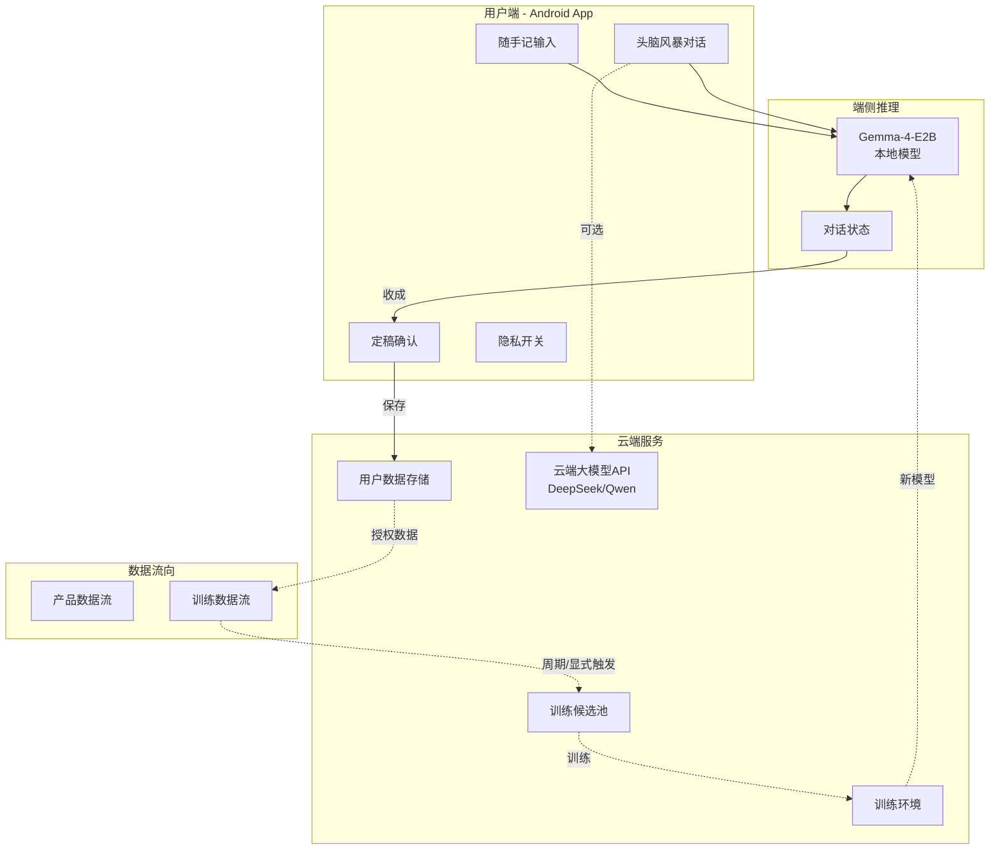
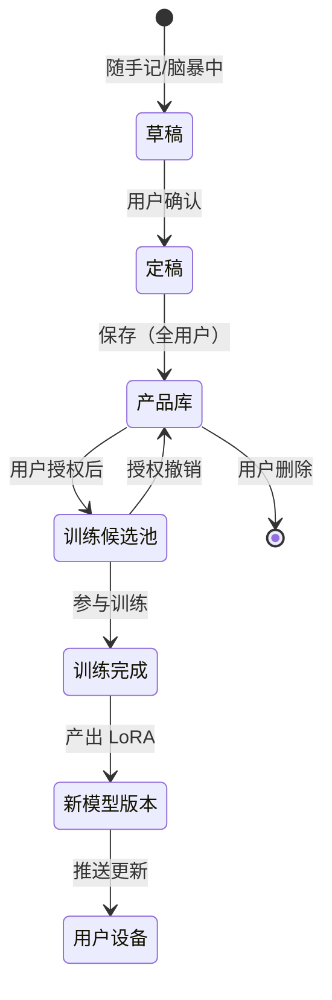
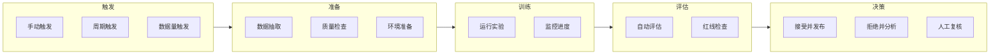

# 10. 基础设施与运维（Infra / Ops）

> 本文档为项目 **shaping** 阶段方案描述：界定数据流架构、用户隐私开关、平台规范与运维类型。**不包含**具体数据库选型、API 设计、云服务配置或代码实现。

---

## 10.1 数据流架构

### 10.1.1 数据流全景



### 10.1.2 产品数据流（主链路）

| 步骤 | 数据 | 流向 | 说明 |
|------|------|------|------|
| 1 | 随手记/脑暴输入 | 用户 → 端侧模型 | 本地推理，低延迟 |
| 2 | 对话状态 | 端侧维护 | 多轮上下文，本地存储 |
| 3 | 定稿卡片 | 用户确认 → 云端存储 | 持久化保存 |
| 4 | 卡片/标签/关联 | 云端 ↔ 多端同步 | 用户数据权威在云端 |

**设计原则**：
- 端侧负责「实时交互」，云端负责「持久化 + 训练」
- 产品可用性优先，端侧可离线使用基础功能
- 定稿后才上云，草稿本地暂存

### 10.1.3 训练数据流（次链路）

| 步骤 | 数据 | 流向 | 控制点 |
|------|------|------|--------|
| 1 | 定稿卡片 | 产品库 → 训练候选池 | **需用户授权** |
| 2 | 候选池数据 | 周期性/触发式 → 训练环境 | 管理员操作 |
| 3 | 训练产出 | 新 LoRA 权重 → 端侧分发 | 版本管理 |
| 4 | 模型更新 | 推送到用户设备 | 用户感知可选 |

**设计原则**：
- 用户数据进训练池必须显式授权
- 授权可撤销，撤销后数据立即从候选池移除
- 训练与产品服务解耦，可独立维护

### 10.1.4 数据状态流转



---

## 10.2 用户隐私开关

### 10.2.1 开关设计原则

| 原则 | 说明 |
|------|------|
| **默认保守** | 新用户默认「不参与模型改进」 |
| **显式授权** | 参与训练需用户主动开启 |
| **粒度可控** | 可全局开关，也可按内容类型 |
| **即时生效** | 开关状态变更立即生效，历史数据按新政策处理 |
| **可逆可删** | 可随时关闭，可请求删除已贡献数据 |

### 10.2.2 开关类型与层级

```
隐私控制中心
├── 全局开关: 参与模型改进
│   ├── 开启 → 定稿卡片可进训练候选池
│   └── 关闭 → 所有数据不进候选池，已进的数据移除
│
├── 内容类型开关（可选粒度）
│   ├── 头脑风暴对话 → 是 / 否
│   ├── 随手记草稿 → 否（默认）
│   └── 标签/关联编辑 → 是 / 否
│
└── 数据管理
    ├── 查看我贡献了多少条数据
    ├── 查看最近贡献记录（脱敏）
    └── 删除我的所有贡献数据
```

### 10.2.3 授权流程（首次）

```
用户首次定稿卡片
    ↓
弹窗询问: "是否允许使用您的定稿卡片来改进模型？"
    ↓
├── 选择"是" → 记录授权，该卡片标记为可训练
├── 选择"否" → 记录拒绝，卡片仅保存不进候选池
└── 选择"了解更多" → 展示隐私说明页
    ↓
后续可在"设置-隐私"中随时修改
```

### 10.2.4 数据生命周期与开关关系

| 用户操作 | 产品库 | 训练候选池 | 说明 |
|----------|--------|------------|------|
| 定稿卡片（授权开启） | 保留 | 进入 | 正常流程 |
| 定稿卡片（授权关闭） | 保留 | 不进入 | 仅产品使用 |
| 授权从开→关 | 保留 | **移除** | 即时生效 |
| 授权从关→开 | 保留 | 历史数据**不进** | 仅新数据进入 |
| 删除卡片 | **删除** | **移除** | 彻底删除 |
| 注销账号 | **删除** | **移除** | 全部清除 |

---

## 10.3 平台规范类型

### 10.3.1 分层规范体系

```
平台规范
├── L1: 法律法规层（强制）
│   ├── 数据保护法（个人信息）
│   ├── 生成式AI管理办法
│   └── 应用商店政策
│
├── L2: 平台政策层（强制）
│   ├── Google Play 政策
│   ├── 国内安卓商店政策
│   └── 模型许可证条款
│
├── L3: 产品自律层（自定）
│   ├── 内容安全准则
│   ├── 数据使用边界
│   └── 用户权利保障
│
└── L4: 技术实现层（自定）
    ├── 安全编码规范
    ├── 数据加密策略
    └── 审计日志要求
```

### 10.3.2 L1-L2：外部强制规范

| 规范类型 | 来源 | 关键要求 | 合规策略 |
|----------|------|----------|----------|
| **数据保护** | GDPR/个人信息保护法 | 知情同意、数据删除权 | 隐私开关 + 注销删除 |
| **AI 生成内容** | 生成式AI管理 | 标识 AI 生成、防沉迷 | 产品内声明 |
| **应用商店** | Google Play / 国内商店 | 内容分级、隐私政策 | 上架前审核 |
| **模型许可** | Gemma/Qwen 许可证 | 遵守使用限制 | 选型时评估 |

### 10.3.3 L3-L4：产品自律规范

| 规范类型 | 内容 | 实现方式 |
|----------|------|----------|
| **内容安全** | 禁止生成违法、有害内容 | 模型自带安全对齐 + 输出过滤 |
| **数据边界** | 用户数据不用于其他用户模型 | 账号隔离 + 训练数据隔离 |
| **透明性** | 告知用户模型来源、数据用途 | 设置页展示 |
| **审计日志** | 记录关键操作（训练触发、开关变更） | 后台日志 |

---

## 10.4 运维类型与职责

### 10.4.1 运维场景分类

| 类型 | 场景 | 触发条件 | 响应时效 |
|------|------|----------|----------|
| **产品运维** | 服务可用性、数据同步 | 用户反馈/监控告警 | 小时级 |
| **训练运维** | 训练任务管理、资源调度 | 周期性/手动触发 | 天级 |
| **安全运维** | 红线事件、安全漏洞 | 自动检测/举报 | 分钟级 |
| **数据运维** | 数据清理、备份、合规审计 | 定期/事件触发 | 周级 |

### 10.4.2 训练任务生命周期



### 10.4.3 关键运维操作类型

| 操作 | 执行者 | 审核要求 | 日志要求 |
|------|--------|----------|----------|
| 触发训练任务 | 管理员 | 双人确认（建议） | 记录触发原因 |
| 发布新模型版本 | 管理员 | 评估报告通过 | 记录版本号、基线对比 |
| 修改隐私开关默认值 | 产品负责人 | 法务合规审核 | 记录变更原因 |
| 删除用户数据 | 管理员/用户本人 | 身份验证 | 记录操作人、时间 |
| 紧急回滚模型 | 管理员 | 事后补审批 | 详细记录原因 |

---

## 10.5 内测期简化运维

### 10.5.1 内测期运维原则

| 维度 | 简化策略 |
|------|----------|
| **自动化程度** | 半自动：关键步骤人工确认 |
| **监控范围** | 核心指标：服务可用、训练成功 |
| **响应时效** | 非紧急问题次日处理 |
| **数据规模** | 百级用户，人工可管理 |

### 10.5.2 内测期运维检查清单

```
每周运维检查
├── 产品服务
│   ├── 服务可用性检查
│   ├── 用户反馈汇总
│   └── 数据同步状态
├── 训练任务
│   ├── 候选池数据量统计
│   ├── 上次训练结果归档
│   └── 实验环境资源检查
├── 合规安全
│   ├── 隐私开关变更记录
│   ├── 数据删除请求处理
│   └── 安全红线检查
└── 文档更新
    ├── 实验记录归档
    └── 问题与解决方案记录
```

---

## 10.6 与前后章节的关联

| 章节 | 关联内容 |
|------|----------|
| `3_user_background_shaping.md` | 账号体系、用户权利 |
| `4_object_rule.md` | 定稿卡片是训练数据源 |
| `7_data.md` | 用户数据进训练池规则 |
| `8_train_iterate.md` | 训练实验的运维执行 |
| `9_eval_qa.md` | 评估流程的自动化运维 |

---

## 10.7 边界与非目标（本节）

- **不定**：具体数据库选型（SQLite / PostgreSQL / MongoDB 等）
- **不定**：API 设计（REST / GraphQL / gRPC）
- **不定**：云服务提供商（阿里云 / 腾讯云 / AWS 等）
- **不定**：具体加密算法、密钥管理方案
- **不定**：CI/CD pipeline、容器化方案
- **不定**：监控告警系统选型、日志收集方案
- **不含**：服务端代码、数据库 Schema、API 实现

---

## 文档关系

| 文档 | 内容 |
|------|------|
| `shaping/8_train_iterate.md` | 训练实验流程 |
| `shaping/9_eval_qa.md` | 评估与红线 |
| `shaping/10_infra_ops.md` | 数据流、开关、运维（本文） |
