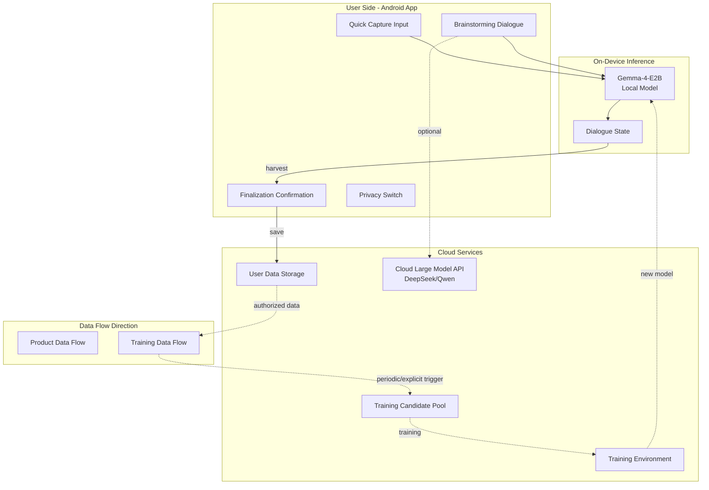
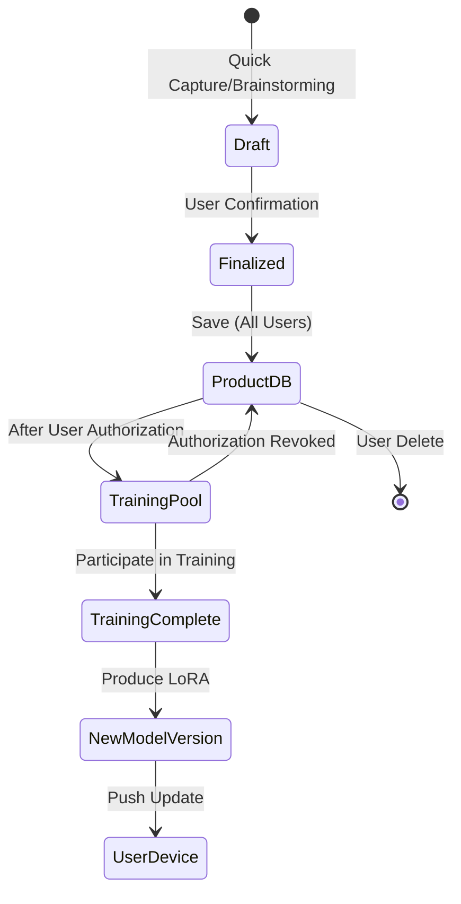

# 10. Infrastructure & Operations (Infra / Ops)

> This document describes the **shaping** phase of the project: defining data flow architecture, user privacy switches, platform compliance, and operations types. **Does not include** specific database selection, API design, cloud service configuration, or code implementation.

---

## 10.1 Data Flow Architecture

### 10.1.1 Data Flow Panorama



### 10.1.2 Product Data Flow (Main Link)

| Step | Data | Flow Direction | Description |
|------|------|----------------|-------------|
| 1 | Quick Capture/Brainstorming Input | User → On-device Model | Local inference, low latency |
| 2 | Dialogue State | On-device maintenance | Multi-turn context, local storage |
| 3 | Finalized Card | User Confirmation → Cloud Storage | Persistent save |
| 4 | Cards/Tags/Associations | Cloud ↔ Multi-device Sync | User data authority in cloud |

**Design Principles**:
- On-device handles "real-time interaction," cloud handles "persistence + training"
- Product availability first, on-device can use basic functions offline
- Only finalized content goes to cloud, drafts stored locally temporarily

### 10.1.3 Training Data Flow (Secondary Link)

| Step | Data | Flow Direction | Control Point |
|------|------|----------------|---------------|
| 1 | Finalized Cards | Product DB → Training Candidate Pool | **Requires user authorization** |
| 2 | Candidate Pool Data | Periodic/Triggered → Training Environment | Admin operation |
| 3 | Training Output | New LoRA Weights → On-device Distribution | Version management |
| 4 | Model Update | Push to User Devices | Optional user notification |

**Design Principles**:
- User data entering training pool requires explicit authorization
- Authorization can be revoked, data immediately removed from candidate pool upon revocation
- Training and product services are decoupled, can be maintained independently

### 10.1.4 Data State Flow



---

## 10.2 User Privacy Switch

### 10.2.1 Switch Design Principles

| Principle | Description |
|-----------|-------------|
| **Conservative by Default** | New users default to "not participating in model improvement" |
| **Explicit Authorization** | Participation requires user actively enabling |
| **Granular Control** | Can toggle globally or by content type |
| **Immediate Effect** | Switch status changes take effect immediately, historical data processed under new policy |
| **Reversible & Deletable** | Can turn off anytime, can request deletion of contributed data |

### 10.2.2 Switch Types & Hierarchy

```
Privacy Control Center
├── Global Switch: Participate in Model Improvement
│   ├── On → Finalized cards can enter training candidate pool
│   └── Off → All data not in candidate pool, already entered data removed
│
├── Content Type Switches (Optional Granularity)
│   ├── Brainstorming Dialogue → Yes / No
│   ├── Quick Capture Draft → No (Default)
│   └── Tag/Association Edit → Yes / No
│
└── Data Management
    ├── View how many items I've contributed
    ├── View recent contribution records (anonymized)
    └── Delete all my contribution data
```

### 10.2.3 Authorization Process (First Time)

```
User first finalizes a card
    ↓
Popup asks: "Allow using your finalized cards to improve the model?"
    ↓
├── Select "Yes" → Record authorization, card marked as trainable
├── Select "No" → Record rejection, card only saved not in candidate pool
└── Select "Learn More" → Show privacy explanation page
    ↓
Can modify anytime later in "Settings - Privacy"
```

### 10.2.4 Data Lifecycle & Switch Relationship

| User Action | Product DB | Training Candidate Pool | Description |
|-------------|------------|-------------------------|-------------|
| Finalize Card (Auth On) | Retained | Enter | Normal flow |
| Finalize Card (Auth Off) | Retained | Not Enter | Product use only |
| Auth On → Off | Retained | **Remove** | Immediate effect |
| Auth Off → On | Retained | Historical data **not enter** | Only new data enters |
| Delete Card | **Delete** | **Remove** | Completely deleted |
| Delete Account | **Delete** | **Remove** | All cleared |

---

## 10.3 Platform Compliance Types

### 10.3.1 Tiered Compliance System

```
Platform Compliance
├── L1: Laws & Regulations (Mandatory)
│   ├── Data Protection (Personal Information)
│   ├── Generative AI Management Measures
│   └── App Store Policies
│
├── L2: Platform Policies (Mandatory)
│   ├── Google Play Policies
│   ├── Domestic Android Store Policies
│   └── Model License Terms
│
├── L3: Product Self-discipline (Self-defined)
│   ├── Content Safety Guidelines
│   ├── Data Usage Boundaries
│   └── User Rights Protection
│
└── L4: Technical Implementation (Self-defined)
    ├── Secure Coding Standards
    ├── Data Encryption Strategy
    └── Audit Log Requirements
```

### 10.3.2 L1-L2: External Mandatory Compliance

| Compliance Type | Source | Key Requirements | Compliance Strategy |
|-----------------|--------|------------------|---------------------|
| **Data Protection** | GDPR/Personal Information Protection Law | Informed consent, data deletion rights | Privacy switch + deletion on account termination |
| **AI Generated Content** | Generative AI Management | Label AI generation, prevent addiction | In-product declarations |
| **App Stores** | Google Play / Domestic Stores | Content rating, privacy policy | Pre-launch review |
| **Model Licenses** | Gemma/Qwen Licenses | Comply with usage restrictions | Evaluate during selection |

### 10.3.3 L3-L4: Product Self-discipline Compliance

| Compliance Type | Content | Implementation |
|-----------------|---------|------------------|
| **Content Safety** | Prohibit generation of illegal, harmful content | Model's built-in safety alignment + output filtering |
| **Data Boundaries** | User data not used for other users' models | Account isolation + training data isolation |
| **Transparency** | Inform users of model source, data usage | Display in settings page |
| **Audit Logs** | Record key operations (training triggers, switch changes) | Backend logs |

---

## 10.4 Operations Types & Responsibilities

### 10.4.1 Operations Scenario Classification

| Type | Scenarios | Trigger Condition | Response Time |
|------|-----------|-------------------|---------------|
| **Product Operations** | Service availability, data sync | User feedback/monitoring alerts | Hour-level |
| **Training Operations** | Training task management, resource scheduling | Periodic/manual trigger | Day-level |
| **Security Operations** | Redline events, security vulnerabilities | Auto-detection/report | Minute-level |
| **Data Operations** | Data cleanup, backup, compliance audits | Periodic/event trigger | Week-level |

### 10.4.2 Training Task Lifecycle

```mermaid
flowchart LR
    subgraph Trigger[Trigger]
        T1[Manual Trigger]
        T2[Periodic Trigger]
        T3[Data Volume Trigger]
    end
    
    subgraph Prepare[Preparation]
        P1[Data Extraction]
        P2[Quality Check]
        P3[Environment Prep]
    end
    
    subgraph Train[Training]
        R1[Run Experiment]
        R2[Monitor Progress]
    end
    
    subgraph Eval[Evaluation]
        E1[Auto Evaluation]
        E2[Redline Check]
    end
    
    subgraph Decide[Decision]
        D1[Accept and Release]
        D2[Reject and Analyze]
        D3[Manual Review]
    end
    
    Trigger --> Prepare --> Train --> Eval --> Decide
```



### 10.4.3 Key Operations Action Types

| Action | Executor | Review Requirement | Log Requirement |
|--------|----------|-------------------|-----------------|
| Trigger Training Task | Admin | Dual confirmation (recommended) | Record trigger reason |
| Release New Model Version | Admin | Evaluation report passed | Record version number, baseline comparison |
| Modify Privacy Switch Default | Product Lead | Legal compliance review | Record change reason |
| Delete User Data | Admin/User Themselves | Identity verification | Record operator, time |
| Emergency Model Rollback | Admin | Post-approval补审 | Detailed reason recording |

---

## 10.5 Beta Phase Simplified Operations

### 10.5.1 Beta Phase Operations Principles

| Dimension | Simplification Strategy |
|-----------|----------------------|
| **Automation Level** | Semi-automatic: Key steps require manual confirmation |
| **Monitoring Scope** | Core metrics: service available, training successful |
| **Response Time** | Non-urgent issues handled next day |
| **Data Scale** | 100-level users, manageable manually |

### 10.5.2 Beta Phase Operations Checklist

```
Weekly Operations Check
├── Product Services
│   ├── Service availability check
│   ├── User feedback summary
│   └── Data sync status
├── Training Tasks
│   ├── Candidate pool data volume statistics
│   ├── Last training result archiving
│   └── Experiment environment resource check
├── Compliance & Security
│   ├── Privacy switch change records
│   ├── Data deletion request handling
│   └── Safety redline check
└── Documentation Updates
    ├── Experiment record archiving
    └── Issues and solutions documentation
```

---

## 10.6 Relationship with Other Chapters

| Chapter | Related Content |
|---------|-----------------|
| `3_user_background_shaping.md` | Account system, user rights |
| `4_object_rule.md` | Finalized cards are training data source |
| `7_data.md` | Rules for user data entering training pool |
| `8_train_iterate.md` | Training experiment operations execution |
| `9_eval_qa.md` | Automated evaluation pipeline operations |

---

## 10.7 Boundaries & Non-goals (This Section)

- **Not defined**: Specific database selection (SQLite / PostgreSQL / MongoDB, etc.)
- **Not defined**: API design (REST / GraphQL / gRPC)
- **Not defined**: Cloud service provider (Alibaba Cloud / Tencent Cloud / AWS, etc.)
- **Not defined**: Specific encryption algorithms, key management solutions
- **Not defined**: CI/CD pipeline, containerization solutions
- **Not defined**: Monitoring alert system selection, log collection solutions
- **Not included**: Server-side code, database schema, API implementation

---

## Document Relationships

| Document | Content |
|----------|---------|
| `shaping/8_train_iterate.md` | Training experiment workflow |
| `shaping/9_eval_qa.md` | Evaluation and redlines |
| `shaping/10_infra_ops.md` | Data flow, switches, operations (this document) |
