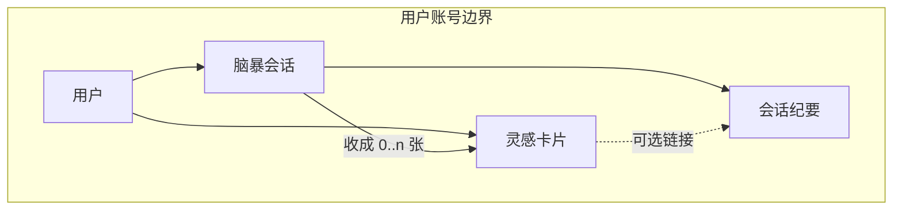
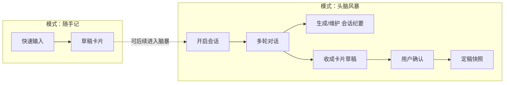
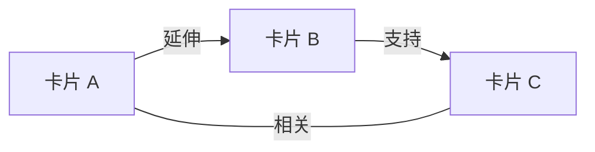
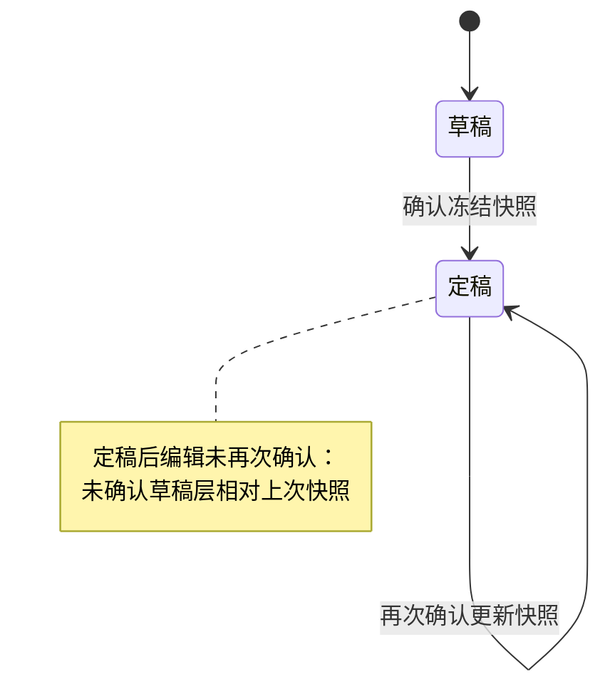
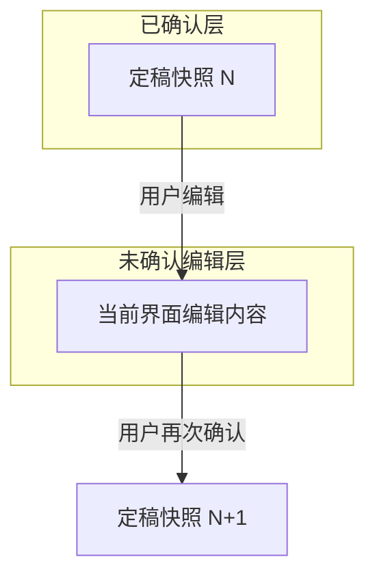

# 4. 核心对象与规则（灵感卡片 · 标签 · 关联 · 定稿）

> 本文档为项目 **shaping** 阶段方案描述：界定持久化核心对象、字段、标签与关联规则、状态与定稿语义。与 **`shaping/3_user_background_shaping.md`** 中的使用场景相互引用，**不包含**具体数据库表结构、API 路径或实现栈。

---

## 4.1 概念总览

- **灵感卡片**：用户在应用内持久保存的一条「灵感资产」，可来自纯手输，也可来自头脑风暴对话后的**收成**；是标签与关联的锚点。
- **脑暴/会话**：承载多轮对话的过程实体；可产生 **会话纪要**（讨论的实质性 summary）。
- **来源摘要**：挂在卡片上的**短溯源元数据**（从哪来、是否对话收成等），**不等于**会话纪要全文。

下列图示帮助区分对象与关系（实现时可合并或拆分表，shaping 不限定）。

### 图 4-1：核心对象关系（概念）

**读图要点**：

- 一个用户拥有多张卡片与多个会话。
- 一次会话可收成 **0 条或多条** 卡片。
- **会话纪要**与会话绑定；多张卡片从同一会话收成时，**可共享同一份纪要**。
- 卡片通过链接指向纪要；**来源摘要**仍属卡片侧字段（短溯源），与纪要全文分离。

### 图 4-2：从「随手记 / 脑暴」到卡片与纪要（主路径）

---

## 4.2 灵感卡片：字段（shaping 最小集）

| 字段（概念） | 必/选 | 含义 |
|--------------|------|------|
| **标题** | 必 | 列表与图上节点的展示名；定稿时 **必填非空**。大模型可生成草稿，用户不修改则定稿采用该标题。 |
| **正文** | 必 | 核心编辑区；定稿时建议 **非空**（至少一句可读实质内容）。 |
| **标签** | 必（允许集合为空由模型补全的规则见下） | 短词集合；定稿规则见 4.4 与 4.3。 |
| **关联** | 必（允许集合为空） | 指向其他卡片的边集合；语义类型见 4.3。 |
| **来源摘要** | 必 | **短溯源**：如纯手输 / 对话收成；可含会话标识等（概念级）。**不承担**整场讨论全文。 |
| **状态** | 必 | **草稿** 或 **定稿**（见 4.4）。 |

**与对话的关系（原则）**：

- 卡片 **正文** 不必等于整段聊天记录；**来源摘要** + **指向会话纪要的链接** 承担追溯。
- 从对话收成时，**定稿**表示用户采纳**当前提炼后的卡片内容**，而非采纳逐字全对话。

---

## 4.3 关联语义（六种 · shaping 定稿）

| 类型 | 含义（用户可理解） | 有向/无向建议 |
|------|-------------------|----------------|
| **相关** | 同主题或同情绪的弱联系 | **无向** |
| **延伸** | B 是 A 的下一步、更深一层或自然推论 | **有向 A → B** |
| **支持** | B 为 A 提供依据、例子或补强 | **有向**（产品内统一一种方向语义即可，如「证据 → 观点」或相反，实现前锁一种） |
| **对立 / 张力** | 两种方向拉扯、互相提醒 | **无向** |
| **合并候选** | 怀疑两条实为一条，尚未合并 | **无向** |
| **衍生自对话** | 强调因某次对话才建立或显式化的联系 | **有向/无向** 实现前再定；语义保留即可 |

**创建规则（shaping）**：

- **用户手动建边**：始终允许（含草稿与定稿之间，内测友好）。
- **系统推荐边**：优先仅对 **「最近一次已确认定稿快照」** 所覆盖的卡片生成候选；用户 **确认后** 落库（避免噪声图）。
- **定稿瞬间的关联集合**：以用户确认时界面上 **保留的边** 为准；**删掉的不进定稿快照**。

### 图 4-3：卡片之间关联（示意）

（上图仅为类型示意；真实图可含更多边与六类混合。）

---

## 4.4 标签规则（shaping）

- **定位**：可检索、可聚合的短关键词，**不是**第二篇正文。
- **形式**：以中英文数字为主；**单标签建议短**（如 shaping 层 1～20 字量级，具体数字实现前可微调）；全角半角与大小写可在实现层做 **等价归一**（本文不定算法）。
- **数量**：单卡标签数设 **软上限**（如 3～8 个），防止标签云化。
- **用户 vs 模型**：
  - **用户标签**：权威；用户可增删改。
  - **模型建议标签**：仅作建议；**用户采纳（含「不修改即视为采纳」的定稿流程）** 后写入定稿快照；未采纳的不进入定稿集合。
- **与关联分工**：**同标签不自动等于有关联**；**有关联不一定同标签**（除非未来单独做「同标签弱连边」且默认关闭）。
- **与状态**：**草稿**上可大量尝试标签；**定稿**时若规则为「空则模型生成」，则以确认瞬间界面上的标签集合为快照。

---

## 4.5 状态与「定稿」精确定义

### 4.5.1 状态取值

- **草稿**：未经过用户「确认」、或定稿后尚未再次确认的新编辑层（见下）。
- **定稿**：用户完成 **确认** 后的状态；表示认可 **当前确认瞬间** 的整套内容为 **定稿快照**。

### 4.5.2 确认与快照（核心语义）

- **定稿是一次状态切换**：自 **草稿** 经用户点击 **确认** → **定稿**；此时冻结 **标题、正文、标签、关联、来源摘要** 等为 **定稿快照**。
- **标题**：定稿时 **必填非空**；可由模型生成，用户不修改则采用。
- **标签**：若为空则由模型生成；用户不修改则采用；若用户删除部分标签再确认，以 **确认瞬间集合** 为准。
- **关联**：以 **确认瞬间** 界面上保留的边为准；删掉的边不进快照。
- **定稿后仍可编辑**：用户有权修改任意字段；在 **未再次点击确认** 前，这些变更构成相对「上一份定稿快照」的 **未确认草稿层**。
- **对外稳定语义**（列表默认、系统推荐关联等）：以 **最近一次已确认定稿快照** 为准，直至用户再次确认生成新快照。
- **再次确认**：用户在定稿状态下编辑后，再次 **确认** → 更新为新的 **定稿快照**（状态仍为定稿）。

### 图 4-4：卡片状态与快照（状态机）

### 图 4-5：定稿快照 vs 未确认编辑层（双轨理解）

### 4.5.3 与训练信号（概念衔接）

- **定稿**：高优先级「结论侧」信号，适合作为训练候选池的准入参考之一（仍受隐私开关与合规章节约束）。
- **草稿**：默认低信号或不进入训练池（除非另设显式标记，首版不建议）。

---

## 4.6 边界与非目标（本节）

- 卡片 **不是** 项目管理任务：不写截止日期、负责人、看板列等，除非单独立项。
- 关联首版 **卡片 ↔ 卡片** 即可；不强制外链知识图谱实体或 GraphRAG 级知识单元。
- **离线、无障碍、国际化** 不在本章展开。

---

## 文档关系

| 文档 | 内容 |
|------|------|
| `shaping/3_user_background_shaping.md` | 用户、场景、双主模式、角色与账号 |
| `shaping/4_object_rule.md` | 卡片、标签、关联、定稿与图示（本文） |
