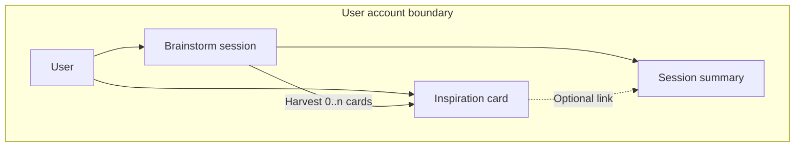
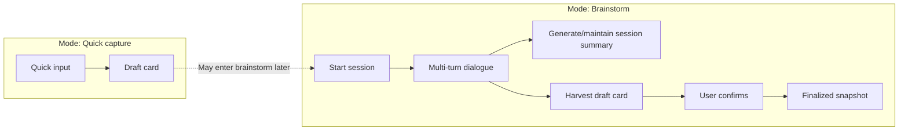
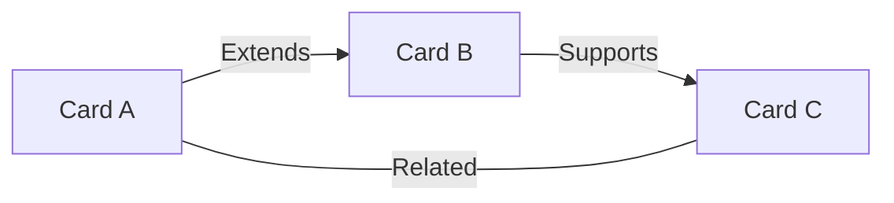
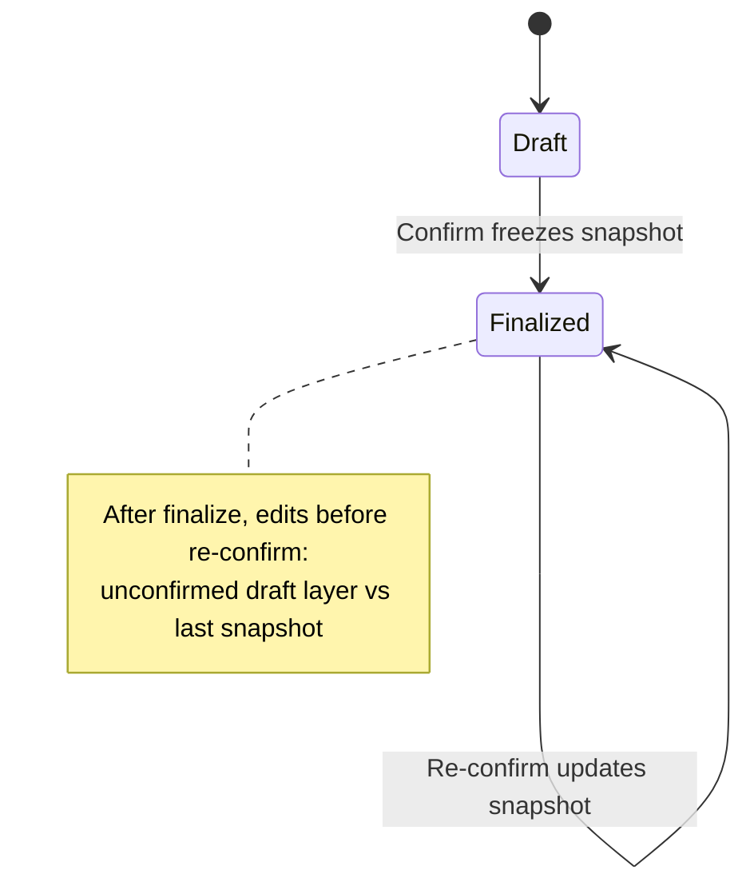
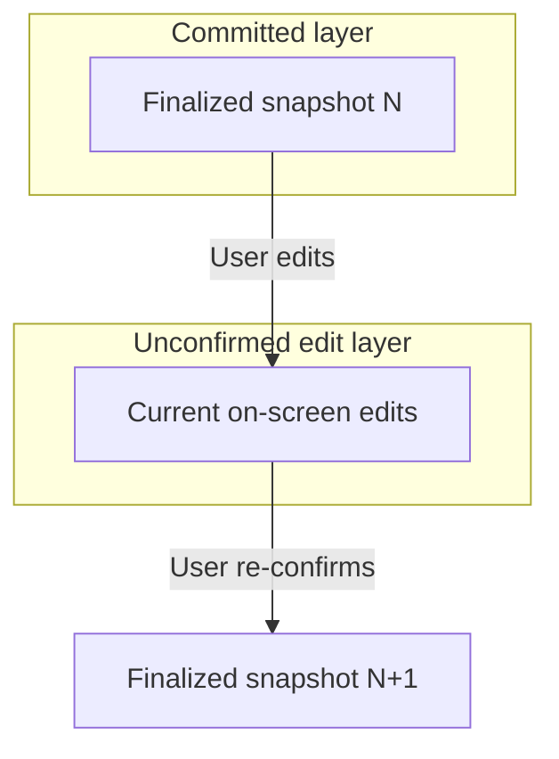

# 4. Core objects and rules (inspiration cards · tags · links · finalization)

> This document describes the project at the **shaping** stage: persistent core objects, fields, tag and link rules, and state / finalization semantics. It cross-references usage scenarios in **`shaping/3_user_background_shaping_EN.md`**. It **does not** specify database schemas, API paths, or implementation stacks.

---

## 4.1 Conceptual overview

- **Inspiration card**: A durable “inspiration asset” the user saves in the app—either typed directly or **harvested** after a brainstorm dialogue; it anchors tags and links.
- **Brainstorm / session**: A process entity holding multi-turn dialogue; may produce a **session summary** (substantive summary of the discussion).
- **Source summary**: **Short provenance metadata** on the card (origin, whether harvested from dialogue, etc.)—**not** the full session summary text.

The diagrams below clarify objects and relationships (tables may be merged or split in implementation; shaping does not prescribe storage layout).

### Figure 4-1: Core object relationships (conceptual)

**How to read the diagram**

- One user owns many cards and many sessions.
- One session can yield **zero or more** cards.
- The **session summary** is bound to the session; multiple cards harvested from the same session **may share** one summary.
- Cards link to the summary; the **source summary** remains a card-level field (short provenance), separate from the full summary body.

### Figure 4-2: From “quick capture / brainstorm” to cards and summary (primary path)

---

## 4.2 Inspiration card: fields (shaping minimum set)

| Field (concept) | Req / opt | Meaning |
|-----------------|-----------|---------|
| **Title** | Required | Display name in lists and on graph nodes; **must be non-empty at finalization**. The model may propose a draft; if the user leaves it unchanged, that title is adopted on finalize. |
| **Body** | Required | Main editor surface; at finalization it should be **non-empty** (at least one readable substantive sentence). |
| **Tags** | Required (set may be empty before model fill rules below) | Short keyword set; finalization rules in §4.4 and §4.3. |
| **Links** | Required (set may be empty) | Edges to other cards; semantic types in §4.3. |
| **Source summary** | Required | **Short provenance**: e.g. manual entry / harvested from dialogue; may include session identifiers (conceptual). **Does not** carry the full discussion text. |
| **Status** | Required | **Draft** or **Finalized** (see §4.5). |

**Relationship to dialogue (principles)**

- The card **body** need not equal the full chat log; **source summary** + **link to session summary** carry traceability.
- When harvested from dialogue, **finalization** means the user accepts the **current distilled card content**, not the verbatim full conversation.

---

## 4.3 Link semantics (six types · shaping locked)

| Type | User-facing meaning | Directed / undirected suggestion |
|------|---------------------|----------------------------------|
| **Related** | Weak tie under same theme or mood | **Undirected** |
| **Extends** | B is the next step, deeper layer, or natural follow-on from A | **Directed A → B** |
| **Supports** | B provides evidence, examples, or reinforcement for A | **Directed** (pick **one** consistent direction in-product, e.g. evidence → claim or the reverse—lock before implementation) |
| **Tension / contrast** | Two directions pull or remind each other | **Undirected** |
| **Merge candidate** | Suspect two cards are really one; not merged yet | **Undirected** |
| **Derived from dialogue** | Emphasizes the link exists or became explicit because of a session | **Directed vs undirected** TBD at implementation; keep the semantic intent |

**Creation rules (shaping)**

- **User-drawn edges**: Always allowed (including between draft and finalized cards—friendly for beta).
- **System-suggested edges**: Prefer generating candidates only for cards covered by the **latest confirmed finalized snapshot**; edges are persisted only after user **confirmation** (reduces noisy graphs).
- **Link set at finalize**: Whatever edges remain on screen at confirm time; **removed edges are not part of the finalized snapshot**.

### Figure 4-3: Links between cards (illustrative)

(The figure is illustrative only; real graphs may mix more edges and all six types.)

---

## 4.4 Tag rules (shaping)

- **Role**: Short keywords for search and clustering—**not** a second long-form body.
- **Form**: Primarily letters, Chinese characters, digits; **keep each tag short** (e.g. on the order of 1–20 characters at shaping granularity—tune at implementation); normalize full/half width and case at the implementation layer (no algorithm specified here).
- **Count**: **Soft cap** per card (e.g. 3–8 tags) to avoid tag-cloud cards.
- **User vs model**:
  - **User tags**: Authoritative; user can add, remove, edit.
  - **Model-suggested tags**: Suggestions only; after **user adoption** (including “unchanged at finalize counts as adoption”), they enter the finalized snapshot; non-adopted suggestions do not enter the finalized set.
- **Division of labor vs links**: **Same tags do not automatically imply a link**; **a link does not require shared tags** (unless you later add an optional “weak edge by shared tag” feature, default off).
- **Status**: **Draft** cards can experiment freely with tags; at **finalization**, if the rule is “empty then model-generated,” the snapshot is whatever tag set is on screen at confirm time.

---

## 4.5 Status and precise meaning of “finalized”

### 4.5.1 Status values

- **Draft**: Not yet through user **confirm**, or—after finalization—new edits that are not yet confirmed again (see below).
- **Finalized**: After user **confirm**; affirms the full set of fields at **that confirm instant** as the **finalized snapshot**.

### 4.5.2 Confirm and snapshot (core semantics)

- **Finalization is a state transition**: **Draft** → user taps **Confirm** → **Finalized**; **title, body, tags, links, source summary**, etc., are frozen as the **finalized snapshot**.
- **Title**: **Required non-empty** at finalize; model may propose; unchanged user copy is adopted.
- **Tags**: If empty, model may generate; unchanged user copy is adopted; if the user deletes some tags then confirms, the **set at confirm instant** wins.
- **Links**: Same as tags—**edges present on screen at confirm instant**; deleted edges are excluded from the snapshot.
- **Editing after finalize**: Allowed; until **Confirm** is tapped again, those edits form an **unconfirmed draft layer** relative to the **last finalized snapshot**.
- **Outward-stable semantics** (default list views, system link suggestions, etc.): Based on the **latest confirmed finalized snapshot** until the user confirms a new one.
- **Re-confirm**: After edits in finalized state, **Confirm** again → new **finalized snapshot** (status remains finalized).

### Figure 4-4: Card status and snapshot (state machine)

### Figure 4-5: Finalized snapshot vs unconfirmed edit layer (two-track mental model)

### 4.5.3 Hook to training signals (conceptual)

- **Finalized**: High-priority “conclusion-side” signal, suitable as one input to gating a training candidate pool (still subject to privacy toggles and compliance).
- **Draft**: Default low signal or excluded from the pool (unless you add explicit flags—**not** recommended for v1).

---

## 4.6 Boundaries and non-goals (this chapter)

- Cards are **not** project-management tasks: no due dates, owners, or kanban columns unless scoped separately.
- Links in v1 are **card ↔ card** only; no requirement to link to external knowledge-graph entities or GraphRAG-scale units.
- **Offline, accessibility, and internationalization** are out of scope here.

---

## Document map

| File | Contents |
|------|----------|
| `shaping/3_user_background_shaping_EN.md` | Users, scenarios, dual primary modes, roles, accounts |
| `shaping/4_object_rule_EN.md` | Cards, tags, links, finalization, diagrams (this document) |

Chinese counterparts: `shaping/3_user_background_shaping_CN.md`, `shaping/4_object_rule_CN.md`.
