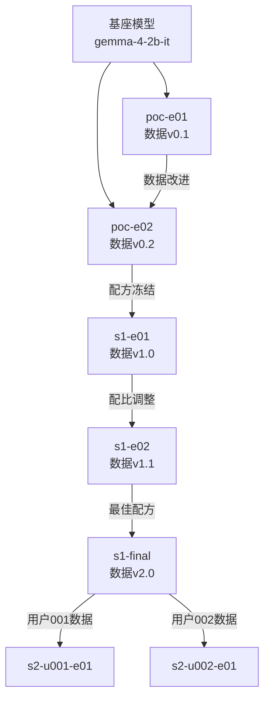

# 8. 训练与实验策略（Train / Iterate）

> 本文档为项目 **shaping** 阶段方案描述：界定训练阶段划分、实验流程、可复现性规范与版本命名习惯。**不包含**具体训练命令、超参数网格或框架配置代码。

---

## 8.1 训练阶段划分（与 6.5 节两阶段微调对应）

### 8.1.1 阶段 0：PoC 验证（预演）

| 属性 | 说明 |
|------|------|
| **目标** | 验证数据配方可行性，建立评估基线 |
| **模型** | 固定 1 个候选（如 Gemma-4-E2B-IT） |
| **数据** | brainstorm_vicuna_10k 子集（1k 条） |
| **实验量** | 3-5 轮快速迭代 |
| **输出** | 基线分数、评估流程跑通 |
| **成功标准** | 能产出可评估的 LoRA 权重文件 |

### 8.1.2 阶段 1-A：基础微调（保守版）

| 属性 | 说明 |
|------|------|
| **目标** | 产出可用的「脑暴 + 总结」基础能力模型 |
| **模型** | 候选 1-2 个（Gemma-4-E2B vs Qwen3.5-2B 对决） |
| **数据** | 完整配方（13.5k 条，见 `7_data.md`） |
| **实验量** | 每个模型 3-5 组数据配比尝试 |
| **输出** | Stage-1 最佳 LoRA 权重 |
| **决策点** | 选定主力基座模型 |

### 8.1.3 阶段 1-B：基础微调（激进版）

| 属性 | 说明 |
|------|------|
| **触发条件** | 阶段 1-A 脑暴能力提升 < 15% 时 |
| **策略调整** | 增加 brainstorm 数据占比、尝试更高 rank |
| **风险** | 可能过拟合、通用能力下降 |
| **止损** | 通用能力任一维度下降 > 20% 时回退 |

### 8.1.4 阶段 2：个性化微调（概念占位）

| 属性 | 说明 |
|------|------|
| **触发条件** | 用户定稿卡片累积到 N 条（N 待定，建议 100+） |
| **数据** | 用户定稿卡片 + 通用保底数据（混合训练防遗忘） |
| **技术** | 在 Stage-1 LoRA 基础上继续训练或训练独立个人 LoRA |
| **输出** | 个人定制版模型（或 LoRA 差分） |
| **回滚** | 个人 LoRA 与基础 LoRA 分离管理，可独立回退 |

---

## 8.2 实验命名与版本规范

### 8.2.1 版本命名格式（语义化）

```
{阶段}-{基座模型}-{数据版本}-{实验序号}-{状态}
```

**示例**：
- `poc-gemma4e2-v1.0-e01-done` —— PoC 阶段，Gemma-4-E2B，数据 v1.0，第 1 次实验，已完成
- `s1-qwen35-2b-v2.1-e03-wip` —— 阶段 1，Qwen3.5-2B，数据 v2.1，第 3 次实验，进行中
- `s2-user001-qwen35-2b-v1.0-e01-done` —— 阶段 2，用户 001，Qwen3.5-2B 基础版，第 1 次个性化实验

### 8.2.2 版本号规则（数据配方）

| 格式 | 含义 | 示例 |
|------|------|------|
| `v{主}.{次}` | 主版本 = 数据配方重大变更 | `v1.0` 首发配方，`v2.0` 新增中文数据集 |
| | 次版本 = 数据配比微调/清洗优化 | `v1.1` 清洗后重训，`v1.2` 配比 35%→40% |

### 8.2.3 实验元数据（必须记录）

每个实验目录应包含：

```
experiment/
├── README.md           # 实验目的、假设、结论
├── META.json           # 结构化元数据
├── data/               # 数据快照（或链接）
└── results/            # 评估结果
```

**META.json 字段**：

```json
{
  "experiment_id": "s1-gemma4e2-v1.0-e03",
  "stage": "stage-1",
  "base_model": "google/gemma-4-2b-it",
  "data_version": "v1.0",
  "data_mix": {
    "brainstorm_en": 5000,
    "brainstorm_cn": 5000,
    "general": 3000,
    "seed": 500
  },
  "method": "LoRA",
  "rank": 8,
  "epochs": 3,
  "status": "completed",
  "created_at": "2026-06-15",
  "parent_experiment": "s1-gemma4e2-v1.0-e02",
  "baseline_scores": {...},
  "result_scores": {...},
  "decision": "accept | reject | iterate"
}
```

---

## 8.3 可复现性规范

### 8.3.1 随机种子固定

| 场景 | 种子策略 |
|------|----------|
| 探索性实验 | 固定种子 `42`，确保同一配方可复现 |
| 消融实验 | 同一配置跑 3 个不同种子（42, 123, 456），报告均值±方差 |
| 生产级实验 | 固定种子 + 多次运行取平均 |

### 8.3.2 环境快照

| 项目 | 记录方式 |
|------|----------|
| 训练框架版本 | `transformers==x.x.x`, `trl==x.x.x` |
| CUDA / PyTorch | `torch.__version__`, CUDA 版本 |
| 硬件规格 | GPU 型号、显存、数量 |
| 数据集哈希 | 数据文件的 MD5/SHA256 |

### 8.3.3 实验血缘（Lineage）



**血缘记录原则**：
- 每个实验明确标注 `parent_experiment`
- 形成树状历史，便于追溯「从哪次实验改进而来」
- 失败实验也保留记录，避免重复踩坑

---

## 8.4 实验迭代流程

### 8.4.1 单次实验生命周期

```
假设提出 → 数据准备 → 训练执行 → 评估验证 → 决策
    ↑                                            |
    └────────────── 改进/放弃 ←──────────────────┘
```

### 8.4.2 决策类型

| 决策 | 含义 | 下一步动作 |
|------|------|------------|
| **Accept** | 实验达到预期，配方可接受 | 标记为阶段性最佳，进入下一阶段 |
| **Iterate** | 有改进但需微调 | 基于本次调整数据/参数，开新实验 |
| **Reject** | 明显倒退或失败 | 记录失败原因，回退到父实验 |
| **Abandon** | 方向错误/资源不足 | 归档，不再继续该分支 |

### 8.4.3 实验看板（概念）

| 状态 | 实验数限制 | 说明 |
|------|------------|------|
| **WIP**（进行中） | ≤ 2 | 避免并行实验过多导致资源/注意力分散 |
| **Pending Review** | ≤ 3 | 待评估实验队列 |
| **Completed** | 无上限 | 已完成实验归档 |
| **Rejected** | 保留 | 失败实验也保留记录 |

---

## 8.5 阶段间衔接规则

### 8.5.1 从 PoC → Stage 1

| 检查项 | 通过标准 |
|--------|----------|
| 基线建立 | 基座模型在评估集上跑通，分数记录完整 |
| 流程验证 | 能产出 LoRA 权重 + 能加载推理 + 能评估 |
| 数据配方 | 初步确定数据类型和配比范围 |

### 8.5.2 从 Stage 1 → Stage 2

| 检查项 | 通过标准 |
|--------|----------|
| 基础模型 | Stage 1 最佳模型已标记并保存 |
| 用户数据 | 至少 1 个用户累积 N 条定稿卡片 |
| 隐私授权 | 该用户明确授权参与模型改进 |
| 质量抽检 | 用户数据经人工抽检，质量可接受 |

---

## 8.6 与前后章节的关联

| 章节 | 关联内容 |
|------|----------|
| `6_model_strategy.md` | 候选模型决定了实验的基座选择 |
| `7_data.md` | 数据配方版本与本文实验版本对应 |
| `9_eval_qa.md`（待建） | 评估流程是实验决策的依据 |
| `10_infra_ops.md`（待建） | 数据流决定用户数据如何进入 Stage 2 |

---

## 8.7 边界与非目标（本节）

- **不定**：具体训练命令、shell 脚本、Python 训练代码
- **不定**：超参数网格（学习率、batch size、warmup steps 等具体数值）
- **不定**：框架选型（TRL / LLaMA-Factory / unsloth / axolotl 等）
- **不定**：云端训练平台具体配置（AutoDL / HF Jobs / 自建等）
- **不含**：模型量化、导出、部署的具体技术路径

---

## 文档关系

| 文档 | 内容 |
|------|------|
| `shaping/7_data.md` | 数据配方、评估基准 |
| `shaping/8_train_iterate.md` | 训练阶段、实验命名、可复现性（本文） |
| `shaping/9_eval_qa.md`（待建） | 评估流程、质量门禁 |
| `shaping/10_infra_ops.md`（待建） | 数据流、用户开关、运维规范 |
