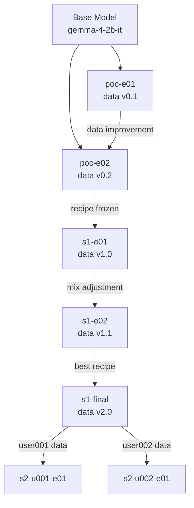

# 8. Training & Experimentation Strategy (Train / Iterate)

> This document describes the **shaping** phase of the project: defining training stage divisions, experiment workflows, reproducibility standards, and version naming conventions. **Does not include** specific training commands, hyperparameter grids, or framework configuration code.

---

## 8.1 Training Stage Division (Corresponding to Section 6.5 Two-Stage Fine-tuning)

### 8.1.1 Stage 0: PoC Validation (Rehearsal)

| Attribute | Description |
|-----------|-------------|
| **Goal** | Validate data recipe feasibility, establish evaluation baseline |
| **Model** | Fix 1 candidate (e.g., Gemma-4-E2B-IT) |
| **Data** | brainstorm_vicuna_10k subset (1k items) |
| **Experiments** | 3-5 rapid iterations |
| **Output** | Baseline scores, evaluation pipeline operational |
| **Success Criteria** | Produce evaluable LoRA weight files |

### 8.1.2 Stage 1-A: Base Fine-tuning (Conservative)

| Attribute | Description |
|-----------|-------------|
| **Goal** | Produce usable "brainstorming + summarization" base capability model |
| **Model** | 1-2 candidates (Gemma-4-E2B vs Qwen3.5-2B showdown) |
| **Data** | Full recipe (13.5k items, see `7_data.md`) |
| **Experiments** | 3-5 data mix attempts per model |
| **Output** | Stage-1 best LoRA weights |
| **Decision Point** | Select primary base model |

### 8.1.3 Stage 1-B: Base Fine-tuning (Aggressive)

| Attribute | Description |
|-----------|-------------|
| **Trigger** | When Stage 1-A brainstorming improvement < 15% |
| **Strategy Adjustment** | Increase brainstorming data proportion, try higher rank |
| **Risk** | Potential overfitting, general capability degradation |
| **Stop-loss** | Roll back when any general capability dimension drops > 20% |

### 8.1.4 Stage 2: Personalization Fine-tuning (Concept Placeholder)

| Attribute | Description |
|-----------|-------------|
| **Trigger** | User accumulated N finalized cards (N TBD, suggest 100+) |
| **Data** | User finalized cards + general safeguard data (mixed training to prevent forgetting) |
| **Technique** | Continue training on Stage-1 LoRA or train separate personal LoRA |
| **Output** | Personal customized model (or LoRA diff) |
| **Rollback** | Separate management of personal LoRA and base LoRA, independent rollback possible |

---

## 8.2 Experiment Naming & Version Standards

### 8.2.1 Version Naming Format (Semantic)

```
{stage}-{base-model}-{data-version}-{experiment-number}-{status}
```

**Examples**:
- `poc-gemma4e2-v1.0-e01-done` — PoC stage, Gemma-4-E2B, data v1.0, 1st experiment, completed
- `s1-qwen35-2b-v2.1-e03-wip` — Stage 1, Qwen3.5-2B, data v2.1, 3rd experiment, in progress
- `s2-user001-qwen35-2b-v1.0-e01-done` — Stage 2, User 001, Qwen3.5-2B base, 1st personalization experiment

### 8.2.2 Version Number Rules (Data Recipe)

| Format | Meaning | Examples |
|--------|---------|----------|
| `v{major}.{minor}` | Major = significant data recipe change | `v1.0` initial recipe, `v2.0` added Chinese dataset |
| | Minor = data mix fine-tuning/cleaning optimization | `v1.1` retrain after cleaning, `v1.2` proportion 35%→40% |

### 8.2.3 Experiment Metadata (Must Record)

Each experiment directory should contain:

```
experiment/
├── README.md           # Experiment purpose, hypothesis, conclusion
├── META.json           # Structured metadata
├── data/               # Data snapshot (or link)
└── results/            # Evaluation results
```

**META.json Fields**:

```json
{
  "experiment_id": "s1-gemma4e2-v1.0-e03",
  "stage": "stage-1",
  "base_model": "google/gemma-4-2b-it",
  "data_version": "v1.0",
  "data_mix": {
    "brainstorm_en": 5000,
    "brainstorm_cn": 5000,
    "general": 3000,
    "seed": 500
  },
  "method": "LoRA",
  "rank": 8,
  "epochs": 3,
  "status": "completed",
  "created_at": "2026-06-15",
  "parent_experiment": "s1-gemma4e2-v1.0-e02",
  "baseline_scores": {...},
  "result_scores": {...},
  "decision": "accept | reject | iterate"
}
```

---

## 8.3 Reproducibility Standards

### 8.3.1 Fixed Random Seeds

| Scenario | Seed Strategy |
|----------|---------------|
| Exploratory experiments | Fixed seed `42` to ensure recipe reproducibility |
| Ablation studies | Run 3 different seeds (42, 123, 456) for same config, report mean±variance |
| Production-grade experiments | Fixed seed + multiple runs averaged |

### 8.3.2 Environment Snapshot

| Item | Recording Method |
|------|------------------|
| Training framework version | `transformers==x.x.x`, `trl==x.x.x` |
| CUDA / PyTorch | `torch.__version__`, CUDA version |
| Hardware specs | GPU model, VRAM, quantity |
| Dataset hash | MD5/SHA256 of data files |

### 8.3.3 Experiment Lineage



**Lineage Recording Principles**:
- Each experiment clearly labels `parent_experiment`
- Form tree-shaped history to trace "which experiment this improved from"
- Failed experiments also retain records to avoid repeated pitfalls

---

## 8.4 Experiment Iteration Workflow

### 8.4.1 Single Experiment Lifecycle

```
Hypothesis → Data Preparation → Training Execution → Evaluation → Decision
    ↑                                                  |
    └────────────── Improvement/Abandon ←───────────────┘
```

### 8.4.2 Decision Types

| Decision | Meaning | Next Action |
|----------|---------|-------------|
| **Accept** | Experiment met expectations, recipe acceptable | Mark as stage best, proceed to next stage |
| **Iterate** | Improvement observed but needs fine-tuning | Adjust data/parameters based on this, start new experiment |
| **Reject** | Significant regression or failure | Record failure reason, roll back to parent experiment |
| **Abandon** | Wrong direction / insufficient resources | Archive, discontinue this branch |

### 8.4.3 Experiment Dashboard (Concept)

| Status | Experiment Limit | Description |
|--------|------------------|-------------|
| **WIP** (In Progress) | ≤ 2 | Avoid parallel experiments causing resource/attention fragmentation |
| **Pending Review** | ≤ 3 | Queue of experiments awaiting evaluation |
| **Completed** | No limit | Archive of completed experiments |
| **Rejected** | Retained | Failed experiments also kept for records |

---

## 8.5 Stage Transition Rules

### 8.5.1 From PoC → Stage 1

| Check Item | Pass Criteria |
|------------|---------------|
| Baseline established | Base model runs through evaluation set with complete score records |
| Pipeline validation | Can produce LoRA weights + can load for inference + can evaluate |
| Data recipe | Preliminary determination of data types and proportion ranges |

### 8.5.2 From Stage 1 → Stage 2

| Check Item | Pass Criteria |
|------------|---------------|
| Base model | Stage 1 best model marked and saved |
| User data | At least 1 user accumulated N finalized cards |
| Privacy authorization | That user explicitly authorized participation in model improvement |
| Quality sampling | User data passed manual quality check |

---

## 8.6 Relationship with Other Chapters

| Chapter | Related Content |
|---------|-----------------|
| `6_model_strategy.md` | Candidate models determine base selection for experiments |
| `7_data.md` | Data recipe versions correspond to experiment versions in this document |
| `9_eval_qa.md` (to be created) | Evaluation pipeline is the basis for experiment decisions |
| `10_infra_ops.md` (to be created) | Data flow determines how user data enters Stage 2 |

---

## 8.7 Boundaries & Non-goals (This Section)

- **Not defined**: Specific training commands, shell scripts, Python training code
- **Not defined**: Hyperparameter grids (learning rate, batch size, warmup steps, etc.)
- **Not defined**: Framework selection (TRL / LLaMA-Factory / unsloth / axolotl, etc.)
- **Not defined**: Cloud training platform configuration (AutoDL / HF Jobs / self-hosted, etc.)
- **Not included**: Model quantization, export, deployment technical paths

---

## Document Relationships

| Document | Content |
|----------|---------|
| `shaping/7_data.md` | Data recipes, evaluation benchmarks |
| `shaping/8_train_iterate.md` | Training stages, experiment naming, reproducibility (this document) |
| `shaping/9_eval_qa.md` (to be created) | Evaluation pipeline, quality gates |
| `shaping/10_infra_ops.md` (to be created) | Data flow, user switches, operations standards |
