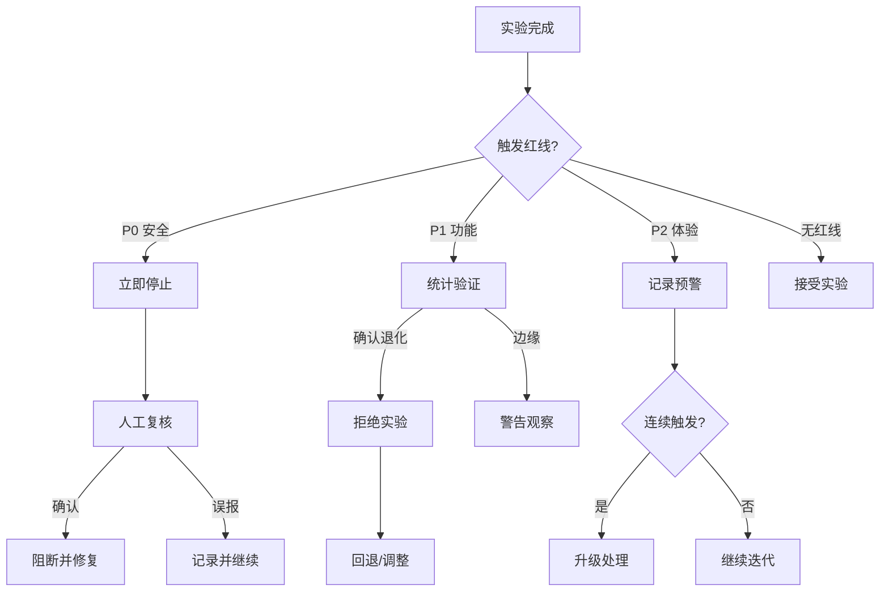

# 9. 评测与质量（Eval / QA）

> 本文档为项目 **shaping** 阶段方案描述：界定评估题集分层、评测流程、质量红线类型与决策机制。**不包含**具体指标计算公式、阈值数值或评分算法实现。

---

## 9.1 评估题集分层体系

### 9.1.1 三层题集结构

```
┌─────────────────────────────────────────────────────────────┐
│  Layer 3: 生产验收集（Acceptance）                           │
│  - 规模: ~100 条                                              │
│  - 来源: 产品核心场景手工设计                                  │
│  - 用途: 最终上线前人工走查                                    │
│  - 更新: 极少变动，仅随产品功能新增而扩展                       │
├─────────────────────────────────────────────────────────────┤
│  Layer 2: 回归验证集（Regression）                             │
│  - 规模: ~500 条                                              │
│  - 来源: 公开基准精选 + 历史问题案例                           │
│  - 用途: 每次实验后自动评估，检测能力退化                       │
│  - 更新: 定期补充新问题，保留历史错题                         │
├─────────────────────────────────────────────────────────────┤
│  Layer 1: 能力探针集（Probe）                                  │
│  - 规模: ~4,000+ 条                                           │
│  - 来源: 公开基准全集 + 领域细分集                             │
│  - 用途: 探索模型能力边界，横向对比                            │
│  - 更新: 随公开基准更新而扩展                                  │
└─────────────────────────────────────────────────────────────┘
```

### 9.1.2 Layer 1：能力探针集（Probe）

**目的**：全面探测模型各项能力，用于横向对比和深层分析

| 子集 | 规模 | 来源 | 探测能力 |
|------|------|------|----------|
| **通用指令** | 805 条 | X-AlpacaEval | 基础指令遵循、中英文切换 |
| **中文对话** | 596 条 | CMT-Eval | 中文多轮连贯性、语用理解 |
| **头脑风暴** | 3,000 条 | brainstorm 系列 | 追问深度、发散与收敛、总结提炼 |
| **多轮深度** | 80 条 | MT-Bench | 长对话上下文保持 |
| **创意写作** | 200 条 | creative_writing 子集 | 创造性生成 |
| **产品场景** | 100 条 | 自建 | 灵感卡片收成、标签生成、关联建议 |

**使用方式**：
- PoC 阶段：跑全集建立基线
- Stage 1：每次实验后跑全集，分析各维度变化
- 统计方法：分层报告，不追求单一总分

### 9.1.3 Layer 2：回归验证集（Regression）

**目的**：快速检测「是否退化」，实验迭代的主评估集

| 类型 | 规模 | 选择标准 |
|------|------|----------|
| **核心能力题** | 200 条 | 从 Layer 1 中选「脑暴 + 总结」高相关题 |
| **保底通用题** | 200 条 | 从 X-AlpacaEval 中选「通用指令遵循」题 |
| **中文保护题** | 100 条 | 从 CMT-Eval 中选「中文场景」题 |

**设计原则**：
- 规模适中：单次评估成本可控（~500 条）
- 分层覆盖：核心能力 + 通用保底 + 语言保护
- 历史错题：记录历次实验中「模型表现差」的题，持续跟踪

### 9.1.4 Layer 3：生产验收集（Acceptance）

**目的**：最终人工走查，确认「产品可用」

| 场景 | 数量 | 形式 |
|------|------|------|
| **随手记快速响应** | 20 条 | 短输入，看响应速度和质量 |
| **头脑风暴完整流程** | 30 条 | 多轮对话，看追问和收敛 |
| **卡片收成** | 20 条 | 长对话后生成结构化卡片 |
| **标签/关联建议** | 20 条 | 检验辅助功能质量 |
| **边界/异常输入** | 10 条 | 空输入、超长输入、特殊字符 |

**使用方式**：
- Stage 1 结束前人工跑一遍
- 不追求「机器评分」，追求「产品可用感知」
- 记录走查笔记，作为上线决策依据

---

## 9.2 评估维度与评委

### 9.2.1 评估维度（shaping 定框架，不定公式）

| 维度 | 含义 | 适用题集 | 权重倾向 |
|------|------|----------|----------|
| **相关性** | 回答是否紧扣主题 | 全部 | 基础 |
| **连贯性** | 多轮对话是否流畅 | 多轮题 | 基础 |
| **有用性** | 是否提供价值（追问/建议） | 全部 | 高（脑暴场景） |
| **创造性** | 是否提供新颖角度 | 脑暴/创意题 | 高（脑暴场景） |
| **结构化** | 输出格式是否规范 | 卡片收成题 | 中 |
| **中文质量** | 中文表达自然度 | 中文题 | 高（中文场景） |

**说明**：
- 各维度评分范围 1-5 分（ shaping 不定具体评分标准）
- 不同题集可侧重不同维度
- 不追求「单一总分」，追求「分维度雷达图」

### 9.2.2 评委模型选择

| 评委 | 适用场景 | 定位 |
|------|----------|------|
| **Qwen-Max** | 中文评估首选 | 主力评委 |
| **GPT-4** | 英文评估、交叉验证 | 辅助评委 |
| **DeepSeek-R1** | 快速批量评估 | 快速评委 |
| **人工** | Layer 3 验收、争议仲裁 | 最终评委 |

---

## 9.3 质量红线类型

### 9.3.1 红线分类体系

```
红线（不可接受）
├── P0: 安全红线（硬阻断）
│   └── 有害内容、违规输出
├── P1: 功能红线（软阻断）
│   └── 核心功能不可用、严重退化
└── P2: 体验红线（警告）
    └── 质量下降但可用
```

### 9.3.2 P0：安全红线（硬阻断）

| 类型 | 描述 | 触发条件 | 决策 |
|------|------|----------|------|
| **有害输出** | 生成违法、歧视、暴力等内容 | 任何评估样本触发 | **立即停止**，排查数据污染 |
| **隐私泄露** | 输出训练数据中的敏感信息 | 检测到可识别个人信息 | **立即停止**，检查数据源 |
| **安全绕过** | 模型被诱导突破安全限制 | 红队测试触发 | **记录并修复**，暂停上线 |

**处理原则**：
- 触发即停，不容妥协
- 需人工复核确认，避免误判
- 修复后方可继续实验

### 9.3.3 P1：功能红线（软阻断）

| 类型 | 描述 | 触发条件（示例） | 决策 |
|------|------|------------------|------|
| **核心能力退化** | 脑暴/总结能力显著下降 | 相关维度下降 > 20% | **拒绝实验**，回退基座 |
| **通用能力崩溃** | 基础对话能力严重受损 | 通用维度下降 > 25% | **拒绝实验**，调整配方 |
| **语言能力丢失** | 中文/英文严重退化 | 对应语言维度下降 > 30% | **拒绝实验**，增数据 |
| **格式混乱** | 输出结构完全失控 | 结构化评分 < 2 | **警告**，迭代修复 |

**处理原则**：
- 统计显著 + 幅度阈值双重判定
- 可设置「警告 → 拒绝」的缓冲期
- 记录详细分维度报告

### 9.3.4 P2：体验红线（预警）

| 类型 | 描述 | 触发条件（示例） | 决策 |
|------|------|------------------|------|
| **创造力下降** | 脑暴发散度降低 | 创造性维度下降 10-20% | **警告**，尝试调整 |
| **响应同质化** | 输出模板化、千篇一律 | 人工走查感知 | **警告**，增加多样性数据 |
| **追问质量下滑** | 追问变得表面化 | 有用性维度下降 10-20% | **警告**，分析原因 |

**处理原则**：
- 不阻断，但需记录
- 连续多次警告需采取行动
- 可作为迭代的优化方向

### 9.3.5 红线决策流程图



---

## 9.4 评估流程与时序

### 9.4.1 单次实验评估流程

```
训练完成
    ↓
生成模型版本（LoRA 权重）
    ↓
[自动] Layer 2 回归验证集（~500条）
    ↓
机器评分 + 统计检验
    ↓
{触发红线?}
    ├─ P0 → 停止，人工介入
    ├─ P1 → 拒绝，分析原因
    └─ 通过 → 进入下一步
    ↓
[按需] Layer 1 能力探针集（~4000条）
    ↓
详细分维度报告
    ↓
决策：Accept / Iterate / Reject
```

### 9.4.2 阶段间评估要求

| 阶段过渡 | 评估要求 | 通过标准 |
|----------|----------|----------|
| PoC → Stage 1 | Layer 2 完整跑通 | 能产出可评估模型 |
| Stage 1-A → 1-B | Layer 2 + 分维度分析 | 脑暴能力提升 < 15% |
| Stage 1 → Stage 2 | Layer 2 + Layer 3 人工走查 | 产品可用感知通过 |
| Stage 2 上线前 | Layer 3 + 安全红线全检 | 无 P0/P1 红线 |

---

## 9.5 评估报告模板（概念）

### 9.5.1 实验评估报告结构

```
实验: s1-gemma4e2-v1.0-e03
├── 基本信息
│   ├── 基座模型: gemma-4-2b-it
│   ├── 数据版本: v1.0
│   └── 实验时间: 2026-06-15
├── 回归验证 (Layer 2)
│   ├── 核心能力: [雷达图/分维度]
│   ├── 通用保底: [雷达图/分维度]
│   ├── 中文保护: [雷达图/分维度]
│   └── 红线检查: [P0/P1/P2 状态]
├── 能力探针 (Layer 1, 如有)
│   ├── 通用指令: [分数]
│   ├── 中文对话: [分数]
│   ├── 头脑风暴: [分数]
│   └── 各维度对比基线: [变化幅度]
├── 与基线对比
│   ├── 脑暴能力: +15% (目标: +10%)
│   ├── 通用能力: -3% (红线: -20%)
│   └── 中文能力: +5% (红线: -15%)
├── 决策建议
│   └── Accept / Iterate / Reject
└── 原始数据链接
    └── [指向详细评分文件]
```

---

## 9.6 与前后章节的关联

| 章节 | 关联内容 |
|------|----------|
| `7_data.md` | 评估数据集来源与构建 |
| `8_train_iterate.md` | 实验决策依赖评估结果 |
| `10_infra_ops.md`（待建） | 评估 pipeline 的自动化运行 |

---

## 9.7 边界与非目标（本节）

- **不定**：具体指标计算公式（如 Rouge-L、BERTScore 等具体算法）
- **不定**：评分阈值的具体数值（如「下降 > 20%」中 20% 可调整）
- **不定**：统计检验的具体方法（t-test / bootstrap / 其他）
- **不定**：评委模型的具体 Prompt 设计
- **不定**：评估代码实现、自动化 pipeline 架构
- **不含**：模型压缩后的精度评估（PTQ / GPTQ 等）

---

## 文档关系

| 文档 | 内容 |
|------|------|
| `shaping/8_train_iterate.md` | 实验迭代流程 |
| `shaping/9_eval_qa.md` | 题集分层、红线类型（本文） |
| `shaping/10_infra_ops.md`（待建） | 评估自动化与运维 |
