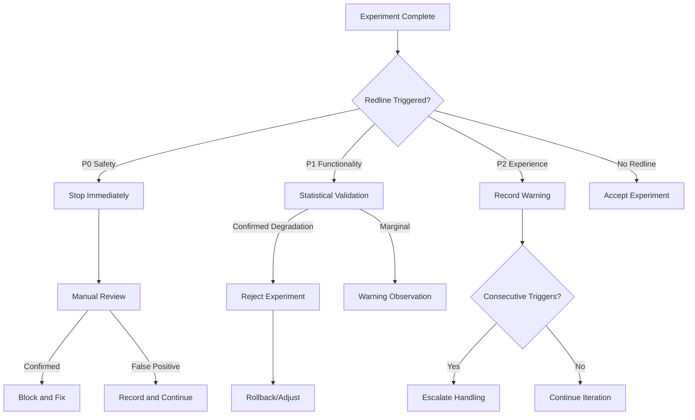

# 9. Evaluation & Quality (Eval / QA)

> This document describes the **shaping** phase of the project: defining tiered evaluation sets, evaluation workflows, quality redline types, and decision mechanisms. **Does not include** specific metric calculation formulas, threshold values, or scoring algorithm implementations.

---

## 9.1 Tiered Evaluation System

### 9.1.1 Three-Layer Question Set Structure

```
┌─────────────────────────────────────────────────────────────┐
│  Layer 3: Production Acceptance Set                          │
│  - Scale: ~100 items                                          │
│  - Source: Hand-crafted for core product scenarios             │
│  - Purpose: Manual review before production launch           │
│  - Updates: Rarely changed, only expand with new features    │
├─────────────────────────────────────────────────────────────┤
│  Layer 2: Regression Validation Set                          │
│  - Scale: ~500 items                                          │
│  - Source: Curated public benchmarks + historical error cases  │
│  - Purpose: Automatic evaluation after each experiment         │
│  - Updates: Periodically add new issues, retain error history  │
├─────────────────────────────────────────────────────────────┤
│  Layer 1: Capability Probe Set                               │
│  - Scale: ~4,000+ items                                       │
│  - Source: Full public benchmark suite + domain subsets      │
│  - Purpose: Explore model capability boundaries              │
│  - Updates: Expand as public benchmarks update               │
└─────────────────────────────────────────────────────────────┘
```

### 9.1.2 Layer 1: Capability Probe Set

**Purpose**: Comprehensive exploration of model capabilities for horizontal comparison and deep analysis

| Subset | Scale | Source | Probed Capabilities |
|--------|-------|--------|---------------------|
| **General Instructions** | 805 items | X-AlpacaEval | Basic instruction following, Chinese/English switching |
| **Chinese Dialogue** | 596 items | CMT-Eval | Chinese multi-turn coherence, pragmatic understanding |
| **Brainstorming** | 3,000 items | brainstorm series | Follow-up depth, divergence & convergence, summarization |
| **Multi-turn Depth** | 80 items | MT-Bench | Long dialogue context retention |
| **Creative Writing** | 200 items | creative_writing subset | Creative generation |
| **Product Scenarios** | 100 items | Self-built | Idea card harvest, tag generation, association suggestions |

**Usage**:
- PoC phase: Run full suite to establish baseline
- Stage 1: Run full suite after each experiment, analyze dimensional changes
- Statistical method: Tiered reporting, not pursuing single aggregate score

### 9.1.3 Layer 2: Regression Validation Set

**Purpose**: Quickly detect "whether degradation occurred," primary evaluation set for experiment iteration

**Why isn't this the same count as the "validation" splits in the data spec?**  
The ~**4,000** rows in [_docs/execution/s1-data-v1.0-spec_CN.md](../execution/s1-data-v1.0-spec_CN.md) (`general_mixed_validation` **1,000** + brainstorm export **3,000**) are **training-pipeline hold-outs**: cut from the same cohort of material as the 13k training recipe, used for early stopping, coarse hyperparameter tuning, monitoring during training, etc.—large enough to be relatively stable.  
The ~**500** Layer 2 items here are **evaluation-pipeline regression checks**: after training (or per checkpoint), a **small, fixed** suite to run often and cheaply to detect capability regressions and compare experiments; at ~4k items, scoring and compute per iteration usually become impractical.  
So **13k train, ~4k train-time validation, ~500 Layer 2 regression** serve **different roles**; they are **not** "one combined validation = 4k + 500," and Layer 2 **does not replace** train-time hold-out (nor vice versa).

| Type | Scale | Selection Criteria |
|------|-------|-------------------|
| **Core Capability Questions** | 200 items | Selected from Layer 1 for high relevance to "brainstorming + summarization" |
| **Safeguard General Questions** | 200 items | Selected from X-AlpacaEval for "general instruction following" |
| **Chinese Protection Questions** | 100 items | Selected from CMT-Eval for "Chinese scenarios" |

**Design Principles**:
- Moderate scale: Single evaluation cost controllable (~500 items)
- Tiered coverage: Core capabilities + general safeguard + language protection
- Historical errors: Track questions where "model performed poorly" in past experiments

**Relationship to repo implementation (Sprint 1)**: The "selected from Layer 1" wording above is the **target intent** at shaping level. The checked-in **`layer2-v0` manifest** is built from local JSONL snapshots with fixed seeds; general and Chinese strata use **proxy** sources for X-AlpacaEval and CMT-Eval—see [_docs/eval/layer2/README.md](../eval/layer2/README.md). Do not conflate the Layer 2 regression list with **`general_mixed_validation.jsonl`**, which is a training hold-out split.

### 9.1.4 Layer 3: Production Acceptance Set

**Purpose**: Final manual review to confirm "product is usable"

| Scenario | Quantity | Format |
|----------|----------|--------|
| **Quick Capture Response** | 20 items | Short input, check response speed and quality |
| **Brainstorming Full Process** | 30 items | Multi-turn dialogue, check follow-up and convergence |
| **Card Harvest** | 20 items | Generate structured cards after long dialogue |
| **Tag/Association Suggestions** | 20 items | Check auxiliary function quality |
| **Boundary/Abnormal Input** | 10 items | Empty input,超长 input, special characters |

**Usage**:
- Run manually before Stage 1 completion
- Not pursuing "machine scores," pursuing "product usability perception"
- Record review notes as production launch decision basis

---

## 9.2 Evaluation Dimensions & Judges

### 9.2.1 Evaluation Dimensions (Framework defined, formulas not defined)

| Dimension | Meaning | Applicable Sets | Weight Tendency |
|-----------|---------|-----------------|-----------------|
| **Relevance** | Whether response stays on topic | All | Base |
| **Coherence** | Whether multi-turn dialogue flows smoothly | Multi-turn sets | Base |
| **Helpfulness** | Whether valuable (follow-up/suggestions) provided | All | High (brainstorming scenario) |
| **Creativity** | Whether novel angles provided | Brainstorming/creative sets | High (brainstorming scenario) |
| **Structuring** | Whether output format is standardized | Card harvest sets | Medium |
| **Chinese Quality** | Naturalness of Chinese expression | Chinese sets | High (Chinese scenario) |

**Notes**:
- Each dimension scored 1-5 (specific scoring standards not defined in shaping)
- Different question sets can emphasize different dimensions
- Not pursuing "single aggregate score," pursuing "multi-dimensional radar chart"

### 9.2.2 Judge Model Selection

| Judge | Applicable Scenarios | Positioning |
|-------|---------------------|-------------|
| **Qwen-Max** | Primary choice for Chinese evaluation | Primary judge |
| **GPT-4** | English evaluation, cross-validation | Auxiliary judge |
| **DeepSeek-R1** | Fast batch evaluation | Fast judge |
| **Human** | Layer 3 acceptance, dispute arbitration | Final judge |

---

## 9.3 Quality Redline Types

### 9.3.1 Redline Classification System

```
Redlines (Unacceptable)
├── P0: Safety Redline (Hard Block)
│   └── Harmful content, policy violations
├── P1: Functionality Redline (Soft Block)
│   └── Core functions unavailable, severe degradation
└── P2: Experience Redline (Warning)
    └── Quality decline but still usable
```

### 9.3.2 P0: Safety Redline (Hard Block)

| Type | Description | Trigger Condition | Decision |
|------|-------------|-------------------|----------|
| **Harmful Output** | Generate illegal, discriminatory, violent content | Any evaluation sample triggers | **Stop immediately**, investigate data contamination |
| **Privacy Leak** | Output sensitive information from training data | Detected identifiable personal information | **Stop immediately**, check data source |
| **Safety Bypass** | Model induced to break safety limitations | Red team testing triggers | **Record and fix**, pause launch |

**Handling Principles**:
- Trigger = immediate stop, no compromise
- Requires manual review confirmation to avoid false positives
- Can only continue experiment after fix

### 9.3.3 P1: Functionality Redline (Soft Block)

| Type | Description | Trigger Condition (Examples) | Decision |
|------|-------------|------------------------------|----------|
| **Core Capability Degradation** | Brainstorming/summarization significantly declined | Related dimension drops > 20% | **Reject experiment**, roll back to base |
| **General Capability Collapse** | Basic dialogue capability severely damaged | General dimension drops > 25% | **Reject experiment**, adjust recipe |
| **Language Capability Lost** | Chinese/English severely degraded | Corresponding language dimension drops > 30% | **Reject experiment**, add data |
| **Format Chaos** | Output structure completely失控 | Structuring score < 2 | **Warning**, iterate and fix |

**Handling Principles**:
- Statistical significance + magnitude threshold dual judgment
- Can set "Warning → Reject" buffer period
- Record detailed dimensional reports

### 9.3.4 P2: Experience Redline (Early Warning)

| Type | Description | Trigger Condition (Examples) | Decision |
|------|-------------|------------------------------|----------|
| **Creativity Decline** | Brainstorming divergence reduced | Creativity dimension drops 10-20% | **Warning**, attempt adjustment |
| **Response Homogenization** | Output templated,千篇一律 | Manual review perception | **Warning**, add diversity data |
| **Follow-up Quality Decline** | Follow-ups become superficial | Helpfulness dimension drops 10-20% | **Warning**, analyze cause |

**Handling Principles**:
- Not blocking, but needs recording
- Consecutive multiple warnings require action
- Can serve as optimization direction for iteration

### 9.3.5 Redline Decision Flowchart



---

## 9.4 Evaluation Workflow & Timeline

### 9.4.1 Single Experiment Evaluation Workflow

```
Training Complete
    ↓
Generate Model Version (LoRA Weights)
    ↓
[Automatic] Layer 2 Regression Validation Set (~500 items)
    ↓
Machine Scoring + Statistical Testing
    ↓
{Redline Triggered?}
    ├─ P0 → Stop, manual intervention
    ├─ P1 → Reject, analyze cause
    └─ Pass → Proceed to next step
    ↓
[As Needed] Layer 1 Capability Probe Set (~4000 items)
    ↓
Detailed Dimensional Report
    ↓
Decision: Accept / Iterate / Reject
```

### 9.4.2 Stage Transition Evaluation Requirements

| Stage Transition | Evaluation Requirement | Pass Criteria |
|------------------|---------------------|---------------|
| PoC → Stage 1 | Layer 2 full run | Can produce evaluable model |
| Stage 1-A → 1-B | Layer 2 + dimensional analysis | Brainstorming improvement < 15% |
| Stage 1 → Stage 2 | Layer 2 + Layer 3 manual review | Product usability perception passed |
| Stage 2 Pre-launch | Layer 3 + safety redline full check | No P0/P1 redlines |

---

## 9.5 Evaluation Report Template (Concept)

### 9.5.1 Experiment Evaluation Report Structure

```
Experiment: s1-gemma4e2-v1.0-e03
├── Basic Information
│   ├── Base Model: gemma-4-2b-it
│   ├── Data Version: v1.0
│   └── Experiment Date: 2026-06-15
├── Regression Validation (Layer 2)
│   ├── Core Capabilities: [Radar Chart/Dimensional]
│   ├── General Safeguard: [Radar Chart/Dimensional]
│   ├── Chinese Protection: [Radar Chart/Dimensional]
│   └── Redline Check: [P0/P1/P2 Status]
├── Capability Probes (Layer 1, if applicable)
│   ├── General Instructions: [Score]
│   ├── Chinese Dialogue: [Score]
│   ├── Brainstorming: [Score]
│   └── Dimensional Baseline Comparison: [Change Magnitude]
├── Baseline Comparison
│   ├── Brainstorming Capability: +15% (Target: +10%)
│   ├── General Capability: -3% (Redline: -20%)
│   └── Chinese Capability: +5% (Redline: -15%)
├── Decision Recommendation
│   └── Accept / Iterate / Reject
└── Raw Data Link
    └── [Points to detailed scoring file]
```

---

## 9.6 Relationship with Other Chapters

| Chapter | Related Content |
|---------|-----------------|
| `7_data.md` | Evaluation dataset sources and construction |
| `8_train_iterate.md` | Experiment decisions depend on evaluation results |
| `10_infra_ops.md` (to be created) | Automated evaluation pipeline operations |

---

## 9.7 Boundaries & Non-goals (This Section)

- **Not defined**: Specific metric calculation formulas (e.g., Rouge-L, BERTScore, etc.)
- **Not defined**: Specific threshold values (e.g., "drops > 20%" where 20% is adjustable)
- **Not defined**: Specific statistical testing methods (t-test / bootstrap / others)
- **Not defined**: Specific prompt designs for judge models
- **Not defined**: Evaluation code implementation, automated pipeline architecture
- **Not included**: Post-compression model accuracy evaluation (PTQ / GPTQ, etc.)

---

## Document Relationships

| Document | Content |
|----------|---------|
| `shaping/8_train_iterate.md` | Experiment iteration workflow |
| `shaping/9_eval_qa.md` | Tiered question sets, redline types (this document) |
| `shaping/10_infra_ops.md` (to be created) | Evaluation automation and operations |
