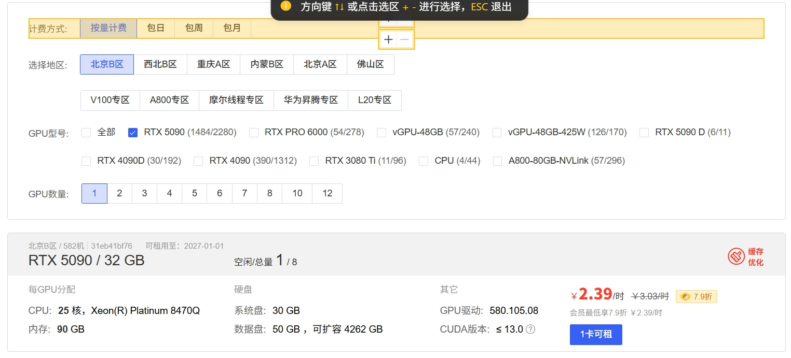
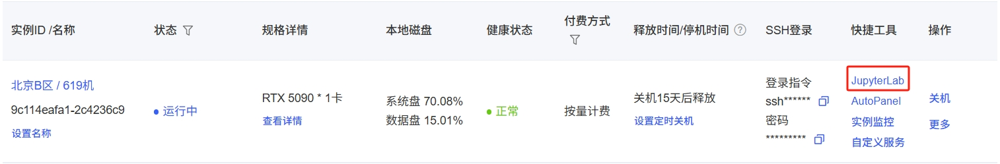
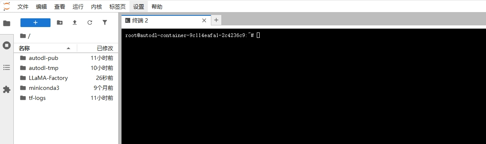
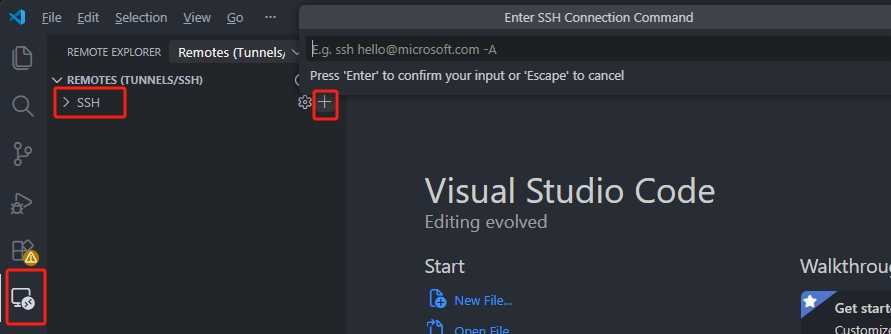
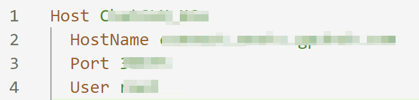
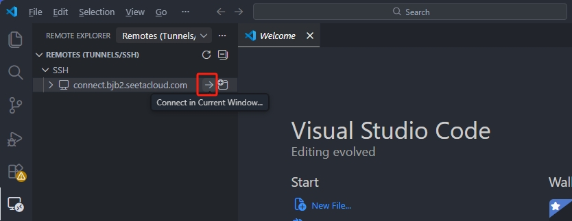
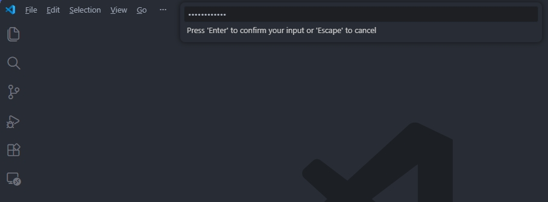

# Renting GPU on AutoDL for Gemma-4-E2B-IT Fine-tuning

> **Purpose**: Configure training environment on AutoDL cloud GPU instances  
> **Applicable GPUs**: RTX 5090 / 4090 / A100 / H100 and other NVIDIA GPUs  
> **Date**: 2026-05-17

---

## 0. Background

### 0.1 Project Background

This project attempts to use **Vibe Coding** to advance an on-device LLM fine-tuning project from scratch within 3-4 months, eventually landing as an **AI Thinking Assistant** Android App.

**Pain Point**: When inspiration strikes, you jot it down, but traditional notes can only "store" not "think" — they don't ask follow-up questions, don't diverge, and certainly don't help you converge into actionable insights.

**Solution**: Let a "casual sentence" go through on-device LLM **question-diverge-converge**, eventually harvested into structured "idea cards". We use **Gemma-4-E2B-IT** (4B class) as base, **LoRA fine-tuning** to align with "brainstorming" rhythm, then quantize and fit into mobile phones, balancing privacy and cost.

> For detailed task overview, see [Sprint1-00_tasks_intro_EN.md](Sprint1-00_tasks_intro_EN.md)

### 0.2 Positioning of This Document: Week 2 PoC Training Environment

**Sprint 1 Progress**:
- Week 1 Completed: Data freeze (v1.0 recipe) + Baseline evaluation (Layer 2 500 samples)
- **Week 2 Goal**: PoC quick closure — Complete end-to-end LoRA fine-tuning with 1k samples to verify "data+training+evaluation" pipeline works

**Core Purpose of PoC** (not to produce perfect model):
1. Verify training scripts run normally (no crashes, no OOM, loss decreases normally)
2. Verify LoRA weights can be exported, loaded, and used for inference
3. Verify fine-tuned model produces evaluable results on Layer 2
4. Accumulate configuration experience for Week 3 Stage 1 conservative training

> For detailed PoC planning, see [Sprint1-05_week2_poc_plan_EN.md](Sprint1-05_week2_poc_plan_EN.md)

---

## 1. Creating AutoDL Instance

### 1.1 AutoDL Configuration

After logging into [autodl](https://www.autodl.com/login), add some funds to your account, then enter `Compute Market` to select a GPU suitable for your project.



After creating the VM, you can see it in `Container Instances` similar to the screenshot below:



Note: You need to shut down the VM when not in use, otherwise it will keep charging.

You can click `JupyterLab` to open the backend for operations similar to local code writing:



How to connect via SSH in VSCode:

VSCode provides the `Remote-SSH` extension, allowing us to connect to remote servers.

First, install the `Remote-SSH` extension in VSCode. Then, find the `SSH` section in VSCode's left sidebar `Remote Explorer`. Click `+`, enter the SSH login command (copy the ssh login command from the AutoDL container instance, input ssh in the VSCode "Enter SSH connection command" window and press Enter):



Click the "C:\User\[UserName]\.sshconfig" file in the popup window, then select `Open Config` in the popup at the bottom right. Edit the config file: host is the hostname (customizable); HostName is the host IP; Port is the port number; User is the username.



If you don't have specific requirements for Port, you can leave these parameters unchanged.

Next, find the newly created SSH remote interface in VSCode's left sidebar `Remote Explorer`, click `Connect in Current Window`:



A new page will open. We need to enter the ssh password from the AutoDL container instance, then press Enter:



Also, how to enable academic acceleration on autodl: `source /etc/network_turbo`.

### 1.2 Post-Startup Environment Check

1. Select **"Algorithm Image"** or **"Basic Image"**: `PyTorch 2.7.0 + Python 3.11 + CUDA 12.4`

2. **GPU Selection**: RTX 5090 (32GB)

```bash
# Check GPU
nvidia-smi

# Expected output (AutoDL RTX 5090):
# +-----------------------------------------------------------------------------------------+
# | NVIDIA-SMI 580.105.08             Driver Version: 580.105.08     CUDA Version: 13.0     |
# +-----------------------------------------+------------------------+----------------------+
# | GPU  Name                 Persistence-M | Bus-Id          Disp.A | Volatile Uncorr. ECC |
# | Fan  Temp   Perf          Pwr:Usage/Cap |           Memory-Usage | GPU-Util  Compute M. |
# |                                         |                        |               MIG M. |
# |=========================================+========================+======================|
# |   0  NVIDIA GeForce RTX 5090        On  |   00000000:A8:00.0 Off |                  N/A |
# | 41%   31C    P8             17W /  575W |       0MiB /  32607MiB |      0%      Default |
# |                                         |                        |                  N/A |
# +-----------------------------------------+------------------------+----------------------+
```

---

## 2. Quick Start (Recommended)

### 2.1 Upload Code to AutoDL

```bash
# On AutoDL instance
git clone https://github.com/zyctime-source/llm-fine-tunning-project.git
cd llm-fine-tunning-project
```

### 2.2 One-Click Training Start

```bash
# Enter project directory
cd /root/autodl-tmp/llm-fine-tunning-project

# If using ModelScope (recommended for China)
export USE_MODELSCOPE=1

# Run auto-start script
bash scripts/train_poc_autodl.sh
```

The script will automatically:
1. Load `.env` environment variables (HF_TOKEN, USE_MODELSCOPE, etc.)
2. Verify GPU availability
3. Create/activate Python virtual environment
4. Install training dependencies (PyTorch, Transformers, TRL, PEFT, ModelScope)
5. Verify installation
6. Check data files
7. Start training

#### `train_poc_autodl.sh` Script Details

| Stage | Function | Description |
|-------|----------|-------------|
| **Environment Check** | Check directory, load `.env` | Ensure in project root, load HF_TOKEN or USE_MODELSCOPE |
| **GPU Verification** | `nvidia-smi` | Show GPU model, driver version, CUDA version, memory |
| **Virtual Environment** | `python3 -m venv venv-train` | Create isolated environment, avoid polluting system Python |
| **Dependency Install** | `pip install -r requirements-train.txt` | Install from Tsinghua mirror, accelerated download |
| **Install Verify** | Import torch, transformers, etc. | Confirm GPU available, versions correct |
| **Data Check** | Check `data/poc_v1.0_1k.jsonl` | Ensure PoC data is prepared |
| **Training Start** | Run `train_poc.py` | Use 4-bit quantization, LoRA rank=8, epoch=1 |

**Script Features:**
- ✅ **Idempotency**: Multiple runs won't recreate environment
- ✅ **Error Handling**: Uses `set -e`, exit immediately on error
- ✅ **China Acceleration**: Uses Tsinghua PyPI mirror
- ✅ **Auto Adaptation**: Supports both HF_TOKEN and USE_MODELSCOPE authentication

---

## 3. Manual Installation (Alternative)

If auto script fails, you can manually execute:

### 3.1 Create Virtual Environment

```bash
cd /root/autodl-tmp/llm-fine-tunning-project

# Create virtual environment
python3 -m venv venv-train

# Activate
source venv-train/bin/activate

# Upgrade pip
pip install --upgrade pip
```

### 3.2 Install Dependencies

```bash
# Use Tsinghua mirror for acceleration
pip install -r requirements-train.txt -i https://pypi.tuna.tsinghua.edu.cn/simple
```

### 3.3 Verify Installation

```bash
python3 -c "
import torch
print(f'PyTorch: {torch.__version__}')
print(f'CUDA available: {torch.cuda.is_available()}')
print(f'GPU: {torch.cuda.get_device_name(0)}')
"
```

Expected output:
```
PyTorch: 2.6.0+cu124
CUDA available: True
GPU: NVIDIA GeForce RTX 5090
```

### 3.4 Run Training

**Using ModelScope (recommended, faster in China):**

```bash
# Set to use ModelScope
export USE_MODELSCOPE=1

# Run training
python3 scripts/train_poc.py \
    --data_path data/poc_v1.0_1k.jsonl \
    --output_dir experiment/s1-poc-e01 \
    --model_name google/gemma-4-2b-it \
    --load_in_4bit \
    --num_epochs 1 \
    --batch_size 1 \
    --learning_rate 2e-4
```

**Using Hugging Face (requires Token):**

```bash
# Basic training (4-bit quantization, save memory)
python3 scripts/train_poc.py \
    --data_path data/poc_v1.0_1k.jsonl \
    --output_dir experiment/s1-poc-e01 \
    --model_name google/gemma-4-E2B-it \
    --load_in_4bit \
    --num_epochs 1 \
    --batch_size 1 \
    --learning_rate 2e-4
```

---

## 4. Training Parameter Adjustment

### 4.1 Adjust Based on GPU Memory

| GPU Memory | Recommended Config | Command |
|------------|-------------------|---------|
| 24GB (4090) | 4-bit quantization, rank=8 | `--load_in_4bit --lora_r 8` |
| 32GB (5090) | 4-bit quantization or bf16, rank=8-16 | `--load_in_4bit --lora_r 8` or `--lora_r 16` |
| 40GB (A100) | 4-bit quantization, rank=16 | `--load_in_4bit --lora_r 16` |
| 80GB (A100/H100) | bf16 full precision, rank=16 | `--lora_r 16` |

### 4.2 Quick Test (for Debugging)

```bash
# Only use 50 samples to quickly verify pipeline
python3 scripts/train_poc.py \
    --data_path data/poc_voc_v1.0_1k.jsonl \
    --max_samples 50 \
    --output_dir experiment/s1-poc-e01-test \
    --num_epochs 1 \
    --load_in_4bit
```

---

## 8. Related Documents

| Document | Purpose |
|----------|---------|
| [Sprint1-05_week2_poc_plan_EN.md](Sprint1-05_week2_poc_plan_EN.md) | Week 2 complete planning |
| [experiment/s1-poc-e01/README.md](../../experiment/s1-poc-e01/README.md) | Experiment details |
| [requirements-train.txt](../../requirements-train.txt) | Dependency list |
| [scripts/train_poc.py](../../scripts/train_poc.py) | Training script |

---

## 9. Revision History

| Date | Revision |
|------|----------|
| 2026-05-17 | Initial: AutoDL RTX 5090 Environment Setup Guide |
