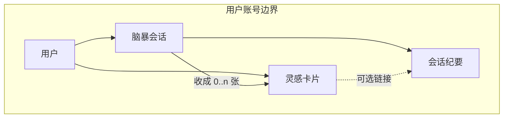
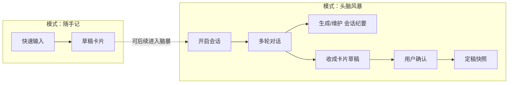
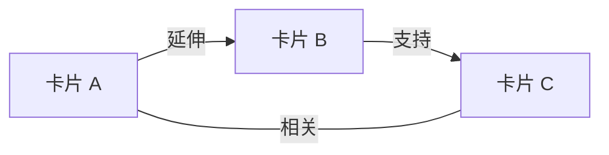
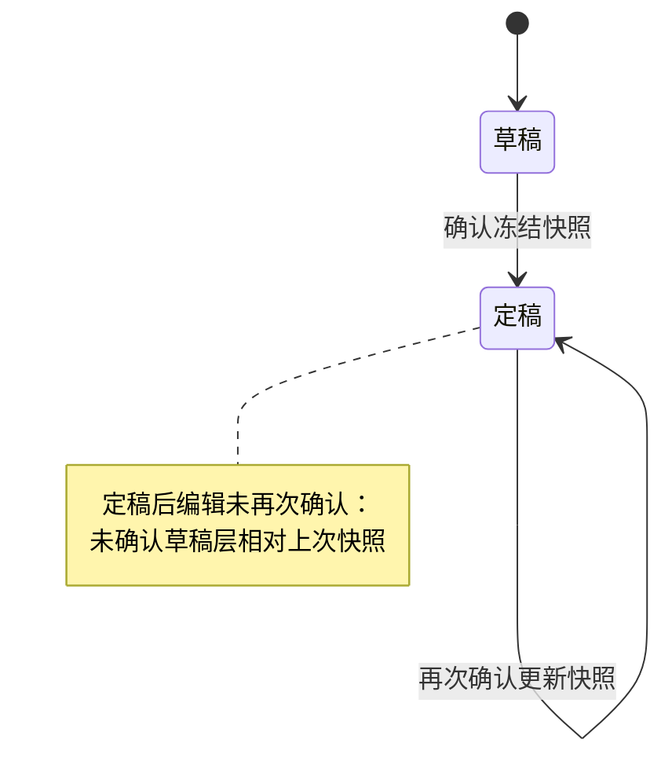
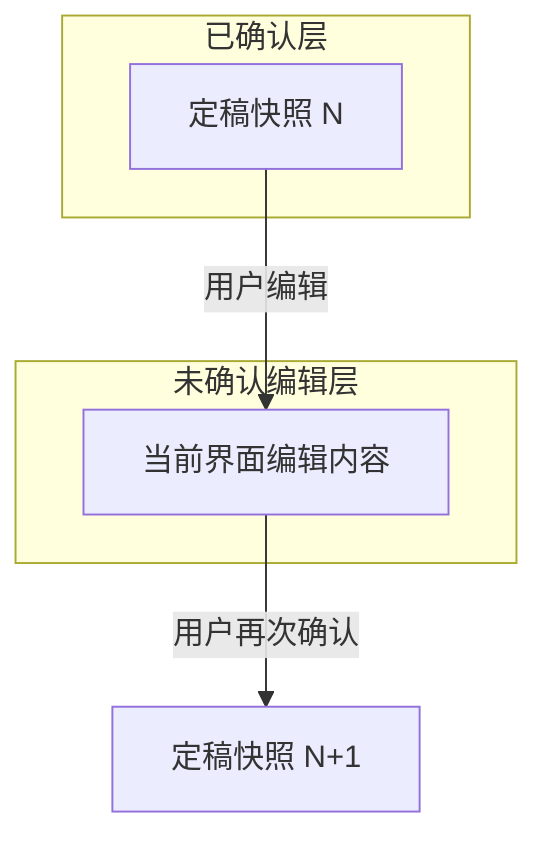

# 完整对话存档 · 2026-05-03

本文档按时间顺序收录当日会话中的**用户提问全文**与**助手回复全文**（非「要点」式缩写；在无损信息前提下略去系统插件元数据、纯工具调用输出及与正文重复的说明）。第十轮曾输出的第 3 节中间稿若已被第十一至十三轮覆盖，正文以说明代重复；**附录 A/B** 与仓库 `shaping/*_CN.md` 全文对齐，可作定稿对照。

路径：`log/2026-05-03-complete_CN.md`。

---

## 第一轮

**【用户】**  
是的。今天，我想和你讨论并确定一个初步的方案。其实可能不能被称之为一个方案，更多类似一个大纲。在这个大纲中，我们把项目的关键部分都需要罗列清楚，不包含如何实施。更多是我们说的 ideation, shaping, PoC, Development, Launch 中的 shaping 部分。你觉得如何？

**【助手】**  
可以，这样定成 **shaping**：把「项目由哪些块组成、块与块之间的边界、成功时我们承认什么」说清楚，**不写怎么做**（那留给 PoC / Development）。下面是一份可以直接当「大纲目录」用的 shaping 清单，你们可以逐条打勾或删改。

---

## 1. 愿景与成功画面（Why / Done when）

- **学习目的**：走完「数据 → 微调 → 评测 → 可对外服务 → 可迭代」的认知地图（不要求一次完美）。
- **产品画面（抽象）**：用户通过轻量前端做「灵感 / 脑暴」类互动；模型能力分两层——**任务向（脑暴+整理）** 与 **用户向（个性化）**；推理在云端，前端不承载整模型。
- **shaping 级成功标准（举例，可改）**：能一句话说清「给谁、解决什么、不解决什么」；关键模块列表无重大遗漏；主要风险与取舍被点名。

---

## 2. 范围边界（In / Out）

- **In**：两阶段微调策略、数据与评测的「占位」、API 形态、合规与隐私原则、实验与发布节奏的高层划分；客户端载体可在 shaping 中占位但可另章终裁。
- **Out（本阶段不承诺）**：具体框架版本、训练脚本、部署拓扑细节、应用商店过审的逐步操作、具体周排期与人力估算（可另文）。

---

## 3. 用户与场景（Who / When）

- **Who**：首要用户与次要用户、多人数据隔离、内测规模假设等。
- **When**：碎片记录 vs 连续脑暴等情境（不定 KPI）。

---

## 4. 产品形态（Surface）

- 客户端与推理部署形态（原生 / 小程序 / 纯 Web 等）可在专门章节收敛；本节 shaping 只要求「存在决策占位」。

---

## 5. 模型与能力策略（Model）

- 小模型与大模型的分工、多模型可选、Tools / skills+Tools 等扩展诉求；不定具体型号与许可证细节。

---

## 6. 数据（Data）

- 公开数据配方、用户数据进训练池原则、来源摘要与会话纪要等对象级概念（与第 4 章对象规则衔接）。

---

## 7. 训练与实验（Train / Iterate）

- 阶段划分、可复现性与版本命名习惯；不写命令与超参网格。

---

## 8. 评测与质量（Eval / QA）

- 题集分层、红线类型；不定指标公式。

---

## 9. 基础设施与运维（Infra / Ops）

- 训练环境、推理服务、观测与密钥配置「要有这一块」。

---

## 10. 安全、隐私与合规（Trust）

- 数据流、用户开关、平台规范类型。

---

## 11. 风险与依赖（Risks / Assumptions）

- 技术、产品、外部依赖假设。

---

## 12. 与后续阶段的接口（Handoff）

- **PoC 应证明什么**：最小闭环；**Development 才展开**：schema、工程结构、CI 等。

---

若你认可这份「shaping 大纲」的颗粒度，下一步（仍属 shaping）通常只做两件事里的一件：**把第 2 节 In/Out 改成你们的一版定稿**，或 **在第 5–6 节里用一句话写死「首版假设」**。

---

## 第二轮

**【用户】**  
我们先夯实用户和场景部分。用户的部分，最重要的用户肯定是自己。但是，我们也需要支持其他用户。在内测简单，我们可以将这个应用推送给其他的几个好友。所以，这个方案肯定是需要支持多人场景。我们先进行一个估算：100人。第二，关于这个应用的核心场景以及解决用户什么核心需求痛点。我们目前仅仅把范围局限在生成灵感和连接灵感上。我们希望给用户一个干净的灵感编辑器，不要有很多功能。生成灵感，自然的，我们可以让用户直接输入自己的灵感，然后就结束了。但是更重要的是，我们需要我们的大模型可以帮助用户进行头脑风暴。所以，如果我们要在边缘端部署一个小模型，我们就需要让这个小模型有比较强的头脑风暴，与用户沟通能力，总结能力，以及支持调用 Tools 或者现在 skills+Tools 的能力。除此之外，我们这个应用也需要支持云端的大模型，比如 deepseek 或者千问，出于学习的角度，我希望知道大模型和小模型微调后的区别；但另外一个方面，也是给于用户更多的选择。说回这个应用的核心场景以及解决用户什么痛点。除了头脑风暴，梳理灵感，记录灵感，之外，我还希望可以给灵感打标签，然后进行灵感关联。有点像 graphrag 中的图，我们不用这么复杂，但是将灵感进行关联往往某种程度上可以看到一些原本看不到的东西（你也可以帮我想想具体是什么看不到的东西）。

**【助手】**  
下面把「用户与场景」收成 shaping 级表述（与后文各轮迭代相比，本轮仍可能包含「小程序/API」等前序讨论惯性；最终以附录 A 中定稿为准）。

### 用户与规模（Who）

- **首要用户**：你自己——产品定义、学习闭环与日常自用。
- **次要用户**：内测可邀请好友；**容量假设约 100 人**；**多人必选语义**为 **按账号隔离数据**：每位用户仅可见自己的灵感卡片、对话、标签与关联图；默认无「全员共享灵感墙」。

### 产品边界（与「干净编辑器」一致）

- **In**：灵感记录、头脑风暴（模型辅助）、梳理与总结、标签、灵感间 **关联**（轻量「图」直觉，不做 GraphRAG 级系统）。
- **Out**：项目管理、协作白板、全文知识库、复杂企业权限等——避免编辑器变工作台。

### 核心场景与用户痛点（三条主叙事）

**场景 A — 有碎片，难成势**  
用户脑子里有一句半句、一个意象或问题，**直接输入可以结束**；更常见的是**卡住了、发散不开、不知道下一步问什么**。痛点：**从「一个点」到「一片可行动的可能性」** 成本高。  
→ **头脑风暴 + 自然对话**：模型帮追问、给角度、控节奏，把独白变成**有结构的对话**。

**场景 B — 聊了很多，留不下来**  
脑暴过程有价值，但**散落在对话里**，事后难检索、难复用。痛点：**从「过程」到「可保存的灵感资产」** 流失严重。  
→ **梳理与总结**（以及「收成卡片」）：把对话收成标题、要点、可选标签，进编辑器。

**场景 C — 灵感多了，只见树不见林**  
记录变多后，人脑不擅长做**跨时间、跨主题的弱联系**。痛点：**单独看每条灵感都「对」，放在一起却看不出模式**。  
→ **标签 + 关联（轻量图）**：用相似度 / 共现 / 手动连边等轻手段，把「可能有关的两条」拉到一起。

### 「关联灵感」可能让用户看见什么「原本看不见的东西」

1. **主题簇与重复自己**：分散在不同日子的多条灵感，可能其实在绕**同一个母题**；关联后更容易发现**在反复碰同一块石头**。  
2. **桥接想法（A ↔ C 经 B）**：A 与 C 表面无关，但都与 B 强相关；可出现 **C 是 A 的变体或后果** 这类结构。  
3. **时间线上的演变**：同一标签或小团里按时间看**措辞与结论的迁移**。  
4. **被遗忘的候选**：旧半成品与新灵感可**复活**关联。  
5. **空白与孤岛**：几乎不连边的灵感提示**从未进入主线叙事**的可能。

### 模型策略（场景级一句）

- **小模型（边缘/端云未定）**：脑暴、对话、总结，及 **Tools / skills+Tools** 的扩展诉求。  
- **云端大模型（如 DeepSeek、千问等）**：可选路由；满足 **对比「微调小模型 vs 大模型默认行为」** 与 **用户选择权**。

### 次要场景

- 历史查看；反馈为第二阶段训练池预留概念位。

---

## 第三轮

**【用户】**  
我们先从（1）开始。

**【助手】**  
下面专门做 **（1）灵感卡片**：shaping 级「最小对象 + 字段含义 + 边界」，仍不涉及库表、接口或实现。

---

## 1. 对象定义（一句话）

**灵感卡片**：用户在应用里**持久保存的一条「灵感资产」**——可以来自纯手输，也可以来自一次脑暴对话被**收成**的结果；卡片是标签与关联的**锚点**。

---

## 2. 最小字段（首版 shaping 建议「必有」）

| 字段（概念名） | 用途（shaping 语言） |
|----------------|----------------------|
| **标题** | 短名，用于列表与图上的节点展示；可由用户改，也可由模型草稿后用户确认。 |
| **正文** | 核心内容：原始灵感句子、展开要点、或从对话提炼后的叙述；编辑器里主要编辑区。 |
| **标签** | 用户（或用户采纳的模型建议）打的**分类与检索维度**；可多值；同一标签跨卡片聚合即「主题簇」的入口。 |
| **关联** | 指向**其他卡片**的轻量边：表达「相关 / 延伸 / 对立 / 来源」等**关系类型可枚举简化**（首版甚至可只有一种「相关」）；支持手动创建为主、机器建议为辅（后者可标为 shaping 里的「可选能力」）。 |

这四项已经支撑你们已定范围：**记录、梳理、标签、连接**。

---

## 3. 强烈建议与卡片绑定、但可标为「实现阶段再定」的元信息

- **身份与时间**：区分多人、排序时间线、做「演变」叙事；内测到 100 人时几乎不可避免。  
- **来源摘要（可选）**：标明来自「纯输入」还是「某次对话收成」；便于以后决定**哪些进训练候选池**，而不必在首版产品里展示复杂溯源 UI。  
- **状态（可选）**：例如草稿 / 已定稿；用于「未成熟不进入关联推荐」等策略，首版可砍掉。

（注：当日后续讨论已将 **来源摘要** 与 **状态** 升格为必选字段，见后文第四轮起。）

---

## 4. 与「对话」的关系（一句话）

**一次脑暴会话**可产出 **0 条或多条卡片**；卡片上的标题/正文/标签可以是**用户从模型草稿中采纳**的结果，与「聊天消息」不必一一对应，避免把整段对话原封搬进卡片正文。

---

## 第四轮

**【用户】**  
是的，来源摘要和状态也是必须的。状态是草稿还是定稿也很重要。与「对话」的关系，你说的很对。下一步，关联语义和标签规则，你都可以给我一些建议。

**【助手】**  
你已把 **来源摘要** 和 **状态（草稿/定稿）** 定为必选，下面在 **shaping** 粒度上把 **关联语义** 和 **标签规则** 写成可直接收进大纲的建议；并顺带把 **来源摘要**、**状态** 与卡片字段对齐一句，避免和上一版矛盾。

---

## 1. 卡片字段对齐（含你新增的必选项）

在「标题 / 正文 / 标签 / 关联」之外， shaping 建议统一表述为：

- **状态（必）**：至少 **`草稿`** / **`定稿`**。  
  - **草稿**：可随意改、可暂不参与「对外展示或关联推荐」（具体策略可后定，但语义先固定）。  
  - **定稿**：表示用户认可当前版本为「当前真理」；更适合作为**关联锚点、列表默认展示、以及未来训练候选池的高信号来源**（是否真进池仍由隐私与开关约束）。

- **来源摘要（必）**：不必长，只要能回答三件事里至少两件：**从哪来**（纯手输 / 某次对话收成）、**可选：对话会话标识（概念级）**、**可选：生成方式**（用户手写 / 用户采纳的模型草稿）。  
  - shaping 原则：**卡片正文不强制等于整段对话**；来源摘要负责**可追溯而不把聊天记录塞进正文**。

---

## 2. 关联语义（建议：少而可解释）

首版建议 **4～6 种关系类型**，再多容易让用户和 UI 犯难；每种用**用户能一眼懂的中文短名**。

| 关系类型 | 含义（给用户的话） | 典型用法 |
|----------|-------------------|----------|
| **相关** | 同一主题或同一情绪下的弱联系，不确定具体结构时用 | 默认连边、机器建议的主类型 |
| **延伸** | B 是 A 的下一步、更深一层、或自然推论 | 「点子在演进」 |
| **支持** | B 为 A 提供依据、例子、或补强论证 | 「A 更像观点，B 像证据」 |
| **对立 / 张力** | 两种方向拉扯、互相限制或互相提醒 | 防止思维只走一条胡同 |
| **合并候选** | 怀疑两条其实是同一条，尚未合并 | 图谱里常见「待整理」边 |
| **（可选）衍生自对话** | 强调这条边是因为某次对话才被看见 | 若你想强调「过程价值」，可加；否则可并入来源摘要而不单独做边类型 |

**规则建议（shaping）**：

- **默认对称或不对称**：  
  - **相关** 可做**无向**（展示上不分父子）。  
  - **延伸 / 支持** 建议**有向**（从 A→B 语义清晰）。  
  - **对立** 可无向（两边平等）。  
- **谁可以创建**：首版 shaping 写死 **用户手动为主**；**系统建议**为辅且需用户**确认才成边**（避免图被噪声填满）。  
- **与状态的关系**：只对 **`定稿`** 卡片开放「对外可见的关联推荐」较干净；草稿之间允许手动连边（内测友好），但可不进入推荐池。

---

## 3. 标签规则（建议： folksonomy + 轻约束）

**3.1 标签是什么**  
标签是 **「可检索、可聚合、可进时间线叙事」的短关键词**，不是第二篇正文。

**3.2 命名与形式**

- **长度**：建议 shaping 写 **1～20 字**（或 1～30 字符），禁止整段句子当标签。  
- **字符**：中英文数字为主；空格策略二选一即可：**不允许空格**（用 `-` 或 `·`）或 **允许多词标签但整体仍短**——首版 pick 一种写进原则。  
- **大小写 / 全半角**：后台可做**规范化**（ shaping 写「存在等价归一规则」即可，不定算法）。  
- **同义词**：允许用户建 `#副业` 和 `#side-project`；是否提供「别名合并」列为 **Phase 2**，首版可不做。

**3.3 数量**

- **单卡标签数**： shaping 建议上限 **例如 3～8 个**（防止每张卡变成标签云）。  
- **全局标签数**：内测阶段不设硬顶，但产品文案可引导「少而准」。

**3.4 谁创建标签**

- **用户标签**：权威；用户可随时增删改（**定稿**卡上改标签是否触发「版本/回滚」可后定）。  
- **模型建议标签**：仅作为 **建议列表**，必须经用户 **采纳** 才写入；未采纳的不进卡片、不进训练池（若你们以后用标签做信号）。

**3.5 与关联的分工（避免功能重叠）**

- **标签**：跨卡片的「**软聚类**」与检索入口（「所有带 X 的卡片」）。  
- **关联**：「**这条与那条为什么在一起**」的**显式理由**（尤其是弱相关、桥接、对立）。  
- shaping 可写一句：**有关联不一定同标签；同标签不自动等于有关联**（除非你们以后做「同标签弱连边」且默认关闭）。

**3.6 与状态的关系**

- **草稿**：允许模型狂给标签建议，用户可不理。  
- **定稿**：建议要求 **至少 0 个标签也可定稿**（避免为打标签而卡住），但若你们希望图更好用，可 shaping 写「鼓励 1～3 个，不强制」。

（注：当日后文将「定稿时标签为空则模型生成」等规则进一步收紧，见第七轮及附录。）

---

## 第五轮

**【用户】**  
关联类型我们先设定 6 个可以的。我觉得你写的非常棒。

**【助手】**  
那就先 **shaping 定稿：关联类型共 6 种**，名称与含义保持我们上一版一致，便于你直接贴进大纲或 `log/`：

1. **相关** — 同主题或同情绪的弱联系，结构不清时的默认类型（展示上可按**无向**理解）。  
2. **延伸** — B 是 A 的下一步、更深一层或自然推论（建议 **有向：A → B**）。  
3. **支持** — B 为 A 提供依据、例子或补强（建议 **有向：A → B**，表示「A 被 B 支撑」或你们统一成「证据指向观点」一种方向即可）。  
4. **对立 / 张力** — 两种方向拉扯、互相提醒（可按 **无向**）。  
5. **合并候选** — 怀疑两条实为一条，尚未合并（可按 **无向**）。  
6. **衍生自对话** — 强调因某次对话才建立或显式化的联系（有向/无向可在实现前再定，shaping 上保留语义即可）。

**标签规则**与 **状态 / 来源摘要** 仍按我们已对齐的 shaping 表述执行即可。

你接下来若继续夯实 shaping，比较顺的下一块是：**「定稿」卡片的精确定义**（例如：是否必须含标题、是否允许空正文等），或 **多人内测下的数据权利一句话**；你更想先钉哪一块？

---

## 第六轮

**【用户】**  
我们来讨论一下「定稿」卡片的精确定义。

**【助手】**  
下面专门把 **「定稿」卡片** 在 shaping 里**说清楚**：它是什么、不是什么、满足什么条件算定稿、定稿之后发生什么、和草稿如何来回切换。仍不写技术实现。

---

## 1. 定义（一句话）

**定稿**：用户声明「**这张灵感卡片在当前认知下已经成立**」，愿意把它当作**稳定的灵感资产**——用于展示、关联、检索的**默认可信版本**；并作为**更高信号**的行为锚点（例如是否进入关联推荐、是否候选进入个性化训练池，由你们另设的隐私与开关约束）。

**草稿**：仍在成形中，允许粗糙、不完整、大改；**不承诺**对外展示或参与「系统级推荐」的语义（手动操作仍可保留，见下）。

---

## 2. 定稿「不是」什么（避免误解）

- **不是**法律意义上的「发布」或「不可更改」。  
- **不是**「内容已验证为真」——只表示**用户认可当前表述**，不是事实核查通过。  
- **不是**「必须已关联其他卡片或必须打满标签」——否则会卡住创作流。

---

## 3. 定稿的前置条件（建议 shaping 写死为「最低门槛」）

在「标题 / 正文 / 标签 / 关联 / 来源摘要 / 状态」框架下，建议：

| 条件 | 建议 |
|------|------|
| **正文** | **非空**（至少有一句可读的实质内容）。纯标题无正文 → 仍建议不允许定稿，或只允许极短「一句即全文」且正文自动等于标题（二选一，避免空壳卡片）。 |
| **标题** | **二选一写进 shaping**：**(A)** 定稿时**必填**非空标题；**(B)** 允许标题暂空，但列表/图上用「正文前 N 字」作展示名，且**定稿前必须补标题或接受自动生成标题**。内测阶段 **(A)** 更简单。 |
| **标签** | **不强制**（0 个也可定稿）；若 0 标签， shaping 可写「鼓励补 1～3 个」而非硬性规则。 |
| **关联** | **不强制**。 |
| **来源摘要** | **必填**（你们已定为必字段）；定稿时至少满足「从哪来」已填写完整（手输 / 对话收成 + 必要标识在 shaping 层说清楚即可）。 |

**结论型 shaping 句**：定稿的硬条件是 **「有实质正文 + 有来源摘要 + 有可用展示名（标题或等价规则）」**；标签与关联均为软鼓励。

---

## 4. 定稿之后：编辑、版本与回退

需要明确「定稿后还能不能改」，否则产品语义会飘。

**推荐 shaping 套餐（清晰且常见）**：

- **定稿后仍允许编辑**任意字段（标题、正文、标签、关联）。  
- **一旦编辑**，有两种命名方式，选一种写进大纲即可：  
  - **(1) 自动降回草稿**：改完需再次定稿（强调「定稿 = 当前快照被认可」）。  
  - **(2) 保持定稿但记版本**：界面仍显示定稿，后台保留历史版本（实现复杂度高，可标 **Later**）。  

内测、单人学习闭环阶段，**(1) 编辑即降回草稿** 通常最好讲、最好做。

**显式「撤回定稿」**：除编辑触发外，可提供「改回草稿」按钮，语义是：**我还不希望这条参与「稳定资产」叙事**。

（注：当日第七、八轮将「定稿后编辑」修订为 **未确认草稿层 + 再次确认更新快照**，与上段「(1) 自动降回草稿」二选一中的不同路线；**以第七、八轮及附录 B 中定稿语义为准**。）

---

## 5. 定稿与「对话」的关系（与你们已定一致）

- 定稿卡片 **不要求** 仍绑定活跃会话；会话可结束，卡片独立存在。  
- **正文**不等于整段对话；**来源摘要**承担「从哪次对话收成」的追溯。  
- shaping 可写：**从对话生成的卡片，定稿表示用户采纳了当前提炼结果**，而不是采纳了整场聊天的逐字记录。

---

## 6. 定稿与「关联」「推荐」的语义（与前面 6 类边一致）

- **系统建议的关联边**：优先只针对 **定稿** 卡片生成候选，用户确认后落库（减少噪声）。  
- **用户手动**：允许在草稿之间、或草稿与定稿之间连边（内测友好）；是否在 UI 上弱化展示可后定。  
- shaping 一句：**「定稿」提高的是系统主动性（推荐），不是用户手动能力的上限。**

---

## 7. 定稿与训练 / 数据信号（若仍是个性化优先）

 shaping 层只定**语义**，不定 pipeline：

- **定稿**表示：**用户愿意把该卡片视为高质量灵感资产**，适合作为「进训练候选池」的**高优先级信号**之一（仍需叠加：显式同意、开关、脱敏等你们另写的原则）。  
- **草稿**默认：**低信号或不进入**训练候选池（除非你们另设「用户显式标记这条草稿也要学习」——一般不建议首版加）。

---

## 8. 多人场景下一句不省的定义

**定稿是「每张卡片、每个用户」的状态**；不存在全局定稿。用户 A 的定稿与用户 B 无关。

---

## 9. 需要你拍板的一个 shaping 二选一（避免实现时打架）

**定稿时标题策略**：  
- **(A)** 标题必填；  
- **(B)** 标题可空，但必须存在「展示名规则」（自动生成或截取正文）。

你更倾向 **(A)** 还是 **(B)**？定下来后，「定稿」这一段就可以原样收进大纲，无需再改语义层。

---

## 第七轮

**【用户】**  
定稿时必填非空标题。大模型可以自动生成标题。如果用户不修改的话，就是定稿的标题。标签也是一样的，如果为空的话，大模型自动生成，用户如果不修改，默认为定稿版本。关联也是一样的道理。很多时候，关联都是大模型生成的，尤其是很久之前的灵感。另外，我们是否还需要保存当时讨论/头脑风暴的 summary，然后和定稿的卡片有一个链接。不知道这是不是你所说的来源摘要。

**【助手】**  
下面把你刚定的规则收进 **shaping**，并单独回答：**「当时讨论的 summary」和「来源摘要」是不是一回事**——建议 **不是一回事**，但可以 **链接在一起**。

---

## 1. 你已定的规则（写成 shaping 可粘贴段）

**定稿时标题**  
- **必填非空标题**。  
- **大模型可生成标题**；用户若不修改，**即以该标题作为定稿标题**。

**定稿时标签**  
- 若用户侧为空（或未补充），**由大模型生成标签**；用户若不修改，**即以该批标签作为定稿标签**。

**定稿时关联**  
- 关联**常由大模型生成**（尤其补全「很久以前的灵感」之间的弱联系）；  
- shaping 建议写清一句：**在用户执行「定稿」动作时，当前界面上保留的关联（含模型建议且未被用户删除的）一并视为用户采纳**，写入定稿版本。若某条边被用户删掉，则不定入。

**仍建议保留的独立动作**  
- **「定稿」仍是显式提交**（按钮或等价操作），避免「没点定稿也算定稿」造成语义纠纷。  
- 含义是：**在提交瞬间**，标题 / 标签 / 关联的当前内容（含模型草稿且未改、或未删）**原子地**成为定稿快照。

---

## 2. 「脑暴 / 讨论的 summary」和「来源摘要」——建议拆开

| 概念 | 建议角色 | 内容形态 |
|------|----------|----------|
| **来源摘要** | **短溯源元数据**：回答「这张卡从哪来、怎么来的」 | 例如：纯手输 / 某次对话收成；**可选**：会话标识、收成时间、是否含模型生成字段等。**宜短**，不必把整场讨论写进来。 |
| **讨论 / 脑暴纪要**（你可单独命名，如 **会话纪要**、**脑暴摘要**） | **当时讨论的实质性总结**：便于用户日后回看「当时想了什么、分歧在哪、怎么收敛到这张卡」 | **一段或多段结构化摘要**（要点列表也可）；体量可明显大于「来源摘要」。 |

**结论**：你问的「保存当时讨论/头脑风暴的 summary，并和定稿卡片链接」——**这更接近「会话纪要 / 脑暴摘要」独立对象（或独立字段）**，**不等同于**我之前说的狭义的「来源摘要」。  
**最佳 shaping**：**两者都要**——**来源摘要**负责机器与合规友好的**轻量溯源**；**会话纪要**负责人类可读的**过程资产**。

---

## 3. 链接关系（shaping 一句话）

- **定稿卡片** ↔ **产生它的那次（或多次）会话**：  
  - **必选**：至少 **来源摘要** 能唯一定位到「哪次收成」（概念上要有指针或等价信息）。  
  - **推荐**：**会话纪要**作为与会话绑定的内容（或会话的子资源），**卡片上存「指向该纪要的链接」**；同一会话若收成多张卡，可**多张卡共享同一份会话纪要**。

这样不会出现「为了溯源把几万字对话塞进卡片」或「来源摘要被迫扛全文」的扭曲。

---

## 4. 和训练 / 学习目标的边界（ shaping 一句）

- **定稿卡片**：高信号「结论侧」资产。  
- **会话纪要**：高信号「过程侧」资产；是否进入训练池可单独策略（通常更敏感、更长，需更严的同意与脱敏）。  

首版 shaping 可先写：**默认可区分「卡片进池」与「纪要进池」**，不必首版都打开。

---

## 5. 需要你确认的一个小语义（避免「不修改」歧义）

**标签 / 关联**：「大模型生成 → 用户不修改 → 定稿默认」——是否包含这种情况：**模型生成了，但用户把其中某一个标签删了、或删了一条边，再点定稿**？  
 shaping 建议写死：**以定稿提交瞬间界面上的集合为准**（删掉的就不进定稿），与标题逻辑一致。

---

## 第八轮

**【用户】**  
好的，「脑暴 / 讨论的 summary」和「来源摘要」那就分开。标签 / 关联：「大模型生成 → 用户不修改 → 定稿默认」——是否包含这种情况：模型生成了，但用户把其中某一个标签删了、或删了一条边，再点定稿？  
shaping 建议写死：以定稿提交瞬间界面上的集合为准（删掉的就不进定稿），与标题逻辑一致。这里，我觉得定稿就是一个状态切换，比如原本的状态叫草稿，用户点击确认后，状态切换成了定稿。用户有权利进行编辑。但是如果用户编辑后没有点击确认按钮，那么用户新的变更依然是草稿。

**【助手】**  
可以，这样定义比「一改整张卡就整体降回草稿」更贴近你说的「**定稿是一次确认后的状态**」，同时保留「**改完再确认**」的节奏。下面把这段话收成 **shaping 定稿表述**，并补几条避免以后实现时打架的边界句。

---

## 1. 状态与确认（你描述的核心）

- **草稿**：尚未被用户确认的版本（含大模型生成的标题 / 标签 / 关联 / 正文等，凡未经过「确认」的，都视为仍在成形中）。
- **定稿**：用户点击 **确认** 后，**状态从草稿切换为定稿**；表示用户认可**当前界面上的整套内容**成为**最近一次已提交的定稿快照**。
- **定稿之后仍可编辑**：用户始终有编辑权。
- **定稿之后的未确认编辑**：用户若在定稿状态下继续改，但在**再次点击确认之前**，这些变更在语义上仍是 **「草稿层变更」**（未并入定稿）；**对外应以「上一份已确认的定稿快照」为准**，直到用户再次确认。

（与上一句对齐：**定稿提交瞬间**——无论是第一次从草稿确认，还是定稿后的「再次确认」——**界面上的标题 / 标签 / 关联 / 正文集合**即为新的定稿快照；**删掉的不进快照**。）

---

## 2. 和「标签 / 关联 / 以界面为准」的合并写法

- 模型生成 → 用户删部分标签或边 → 再点确认：**以确认瞬间集合为准**，与标题逻辑一致。  
- **第一次确认**：草稿 → 定稿。  
- **第二次及以后确认**：在已有定稿快照之上，**用当前界面内容覆盖生成新的定稿快照**（仍是状态「定稿」，只是快照版本前进）。

---

## 3. 建议同时写死的 3 条「产品语义」，避免歧义

1. **「有未确认编辑」时**，列表/图/推荐若需要稳定锚点：默认仍挂 **上一份已确认定稿** 的展示与关联语义；或 UI 明确标「有未保存更改」——二选一的展示策略 shaping 里点一句即可。  
2. **放弃未确认编辑**：应存在「恢复为上次已确认定稿」类语义（不必在此定按钮文案）。  
3. **会话纪要 / 来源摘要**：仍按我们已分的两类；**定稿快照更新**不自动改写历史「会话纪要」全文，除非你们另定「从编辑再生成纪要」的流程（首版可不开放）。

---

## 4. 一句话收束（可直接贴大纲）

**定稿 = 经用户确认的状态；确认瞬间冻结当前卡片内容快照。定稿后编辑在未再次确认前属于草稿层变更，不覆盖已确认定稿快照。**

若你愿意再收紧半步：第二次按钮在 shaping 里是否统一都叫 **「确认」**，还是区分 **「确认定稿」** / **「更新定稿」**——只影响文案，不改变上述语义。

---

## 第九轮

**【用户】**  
可以的，这里不再进一步 shaping 了，我觉得按照目前的阶段，已经非常细节了。你觉得呢？

**【助手】**  
我觉得**可以停在这里**。

就 **shaping** 而言，你们已经把「为谁做、做什么与不做什么、卡片对象、草稿/定稿与确认快照、来源与纪要拆分、六类关联、标签与模型建议的边界、百人内测与多人隔离」都落到了**不互相打架**的程度；再往下多半是 **UI 文案、按钮命名、异常流程** 或 **库表/API**，那更适合放进 **PoC / Development** 里随实现迭代，而不是继续在 shaping 里堆。

若你认同阶段切换：下一步自然是从 shaping **抽一页「PoC 要证明什么」**（最小闭环清单），或开始 **AutoDL 上第一次 LoRA 的技术预演**——你更想先动哪条线？

---

## 第十轮

**【用户】**  
我们初步完成了 3. 用户与场景（Who / When）……请你帮助我整理一下刚才的记录，对于 3. 用户与场景，进行一个整合。然后再看看这部分还有哪些缺失的。

**【助手】**  
（本轮助手给出了「第 3 节」的长篇整合稿，并附「本节仍缺或可后置」表；其后第十一、十二、十三轮在用户要求下分别删除了小程序锁定、补充了双主模式、并写入管理员与账号体系。**与最终落盘相比，第十轮文本已被后续轮次覆盖**；为节省篇幅，此处不重复粘贴已被覆盖的旧版全文。）

**本轮要点（历史记录）**：输出整合稿第 3 节雏形；列出缺失项：When 更细、管理员、账号体系、离线/无障碍/国际化可后置等。

---

## 第十一轮

**【用户】**  
3. 用户与场景（Who / When）不要包含形态：以微信小程序为主交互载体，因为我之后还是需要和你讨论，是不是直接开发 Kotlin 的安卓应用更为合适。

**【助手】**  
（本轮助手给出「删除小程序锁定、增加客户端另章决策边界」后的第 3 节全文修订；**该修订已融入附录 A 当前正文**。）

---

## 第十二轮

**【用户】**  
可选叙事：碎片时间随手记；专门留出一段连续时间做脑暴与收成定稿——仅作情境描述，不作为 KPI。这部分，确实，我们可以分成两个部分，一个叫：随手记，记录完就结束了。先保存为草稿。另一个是头脑风暴。两个模式，你可以想象一下，在一个界面上，就是这两个主要按钮，其他的都可以是小的按钮或者隐藏的那种。

**【助手】**  
可以，这样 **「When」** 就从抽象叙事落成了 **两种主模式 + 一种界面隐喻**，很适合写进 **3. 用户与场景**。

---

### 两种主模式（界面级 shaping）

**模式 A：随手记**  
- **意图**：碎片时间**最快**把念头记下来，**记录完即可结束**。  
- **默认结果**：**先保存为草稿**（不要求当场补标题、标签、关联或进入对话）。  
- **与定稿关系**：用户之后可在编辑器里补全、再进入确认流；**不强迫**从随手记直接进入定稿。

**模式 B：头脑风暴**  
- **意图**：用户预留一段连续时间，以**对话式脑暴**为主路径，并在结束时把过程**收成**灵感卡片（再按你们已定规则走**确认 / 定稿快照**）。  
- **与草稿关系**：脑暴过程中可产生中间态内容；**收成到卡片**时仍遵循「草稿 → 确认 → 定稿」语义。

**两种模式的关系（shaping 一句）**  
- **随手记**偏「**捕获**」；**头脑风暴**偏「**展开—收敛—资产化**」。同一灵感对象可从随手记**演进**为脑暴素材（是否提供显式入口如「对此条开启脑暴」可标为 **Later**）。

---

### 主界面隐喻（你描述的「两个大按钮」）

- **首屏 / 主界面**以 **两个主操作** 为视觉与信息架构核心：**随手记**、**头脑风暴**。  
- **其余能力**（历史、设置、搜索、反馈入口等）采用**次级入口**：小按钮、图标、更多菜单或隐藏层级，避免主界面变成工作台。

---

### 建议写进「3.6 When」的替换段落（整合版）

- **使用情境**由两种主模式承载，而非 KPI：  
  - **随手记**：移动场景下的快速捕获，**默认草稿**，结束成本低。  
  - **头脑风暴**：连续时段内的对话式发散与收束，导向**可保存卡片**与后续**定稿确认**。  
- **主界面原则**：**双主按钮**承载上述两种模式；其他功能**弱化为次要或隐藏**，以保持「干净编辑器」的产品承诺。

---

若你愿意再钉一句 **shaping** 防歧义：**随手记**是否允许「保存后立刻再点一次头脑风暴接续同一条草稿」——首版可以写 **「允许，但不强制做专门入口」**，实现阶段再决定是主按钮二次流还是卡片内操作。

---

## 第十三轮

**【用户】**  
内测管理员角色与账号体系我不是很熟悉，请你按照 best practice 进行编辑。离线 / 无障碍 / 国际化可以先不写。好的，现在，请你帮助再给我一版 3. 用户与场景（Who / When）的方案描述。

**【助手】**  
（本轮输出即为 **`shaping/3_user_background_shaping_CN.md` 当前正文**；为完整存档，见下文 **附录 A**，与仓库文件逐字一致。）

---

## 第十四轮

**【用户】**  
好的，还有一个，之前讨论的「灵感卡片」最小字段（标题 / 正文 / 标签 / 关联），关联语义和标签规则，「定稿」卡片的精确定义，这些是否也应该写进方案中。

**【助手】**  
**应该写进方案。** 它们已经不是「随口讨论」，而是后面 PoC、接口和数据都能对齐的 **领域规则**；不写进文档，后面很容易和「3. 用户与场景」里的说法打架。

更稳妥的写法是：**不要全部塞进第 3 节**，而是 **单独成章**，和第 3 节 **互相引用**。

---

### 为什么单独成章

- **第 3 节**侧重 **Who / When / 主模式与界面隐喻**（人怎么用）。  
- **卡片字段、标签规则、六类关联、定稿与确认快照**侧重 **系统里持久化什么、状态怎么变**（领域模型与生命周期）。  
混在一起会让第 3 节过长，且「场景」与「对象定义」两类读者关注点不同。

---

### 建议在总方案中的位置与标题（示例）

可在 **「3. 用户与场景」** 之后增加一章，例如：

**「4. 核心对象与规则（灵感卡片 · 标签 · 关联 · 定稿）」**

其中按块收录你们已定内容即可：

| 小节 | 收录内容 |
|------|----------|
| 4.1 灵感卡片 | 最小字段：标题、正文、标签、关联；**来源摘要**、**状态**；与对话/会话纪要的关系（来源摘要 vs 脑暴纪要分开、可链）。 |
| 4.2 标签规则 | 短词、数量上限、规范化原则；模型建议 vs 用户采纳；与关联分工。 |
| 4.3 关联语义 | 六类定义及有向/无向建议；系统推荐 vs 手动建边；与定稿快照的关系。 |
| 4.4 状态与定稿 | 草稿 / 定稿；**确认 = 状态切换 + 快照**；定稿后未再次确认前的「草稿层变更」；编辑即界面集合为准等。 |

第 3 节里只需 **一句指向**：「灵感卡片及其定稿、标签、关联规则见第 4 章。」

---

## 小结

- **要写进方案**：是。  
- **建议结构**：**第 3 章保持你现在这版**；**卡片 / 标签 / 关联 / 定稿**整章为 **第 4 章**（编号可按你全文调整）。

如果你愿意，下一步我可以按该章节标题，把 **第 4 章全文**整理成一份可直接粘贴的 shaping 正文（合并我们之前各轮已定结论，不重复展开离线等未讨论项）。

---

## 第十五轮

**【用户】**  
好的，请帮助我将 3. 用户与场景的方案整理写到 `shaping/3_user_background_shaping.md`。4. 核心对象与规则的方案整理写到 `d:\yichao\LLM\llm-fine-tunning-project\shaping\4_object_rule.md`。注意，4. 核心对象与规则可以画一些结构图，或者架构图，方便理解。

**【助手】**  
已根据当日讨论将 **第 3 章**、**第 4 章** 落盘为 shaping 初稿；仓库中实际文件名为 **`shaping/3_user_background_shaping_CN.md`** 与 **`shaping/4_object_rule_CN.md`**（及对应英文 **`_EN.md`**）。第 4 章含 **Mermaid** 概念图（对象关系、双模式主路径、连边示意、状态机、快照与未确认编辑层）。

---

## 第十六轮

**【用户】**  
很好，看起来很不错。现在，请帮助我也各自生成英文的版本，新建两个 markdown 文件：`3_user_background_shaping_EN.md`, `4_object_rule_EN.md`。

**【助手】**  
已新增 `shaping/3_user_background_shaping_EN.md` 与 `shaping/4_object_rule_EN.md`：全文英译；文内交叉引用 `*_EN.md`；第 4 章 Mermaid 节点与边标签英文化。术语示例：**随手记** → *Quick capture*，**定稿** → *Finalized* / *finalization*，**收成** → *harvest*，**来源摘要** → *source summary*，**会话纪要** → *session summary*。

---

## 第十七轮

**【用户】**  
很好，今天我们先把这两个模块的初稿定下来，明天我们来再 review 一遍，然后继续下去。接下来，我们把今天沟通记录的完整版写到：`log/2026-05-03-complete_CN.md`；总结版本写到 `log/2026-05-03-summary_CN.md`，可以参考 `log/2026-05-02-complete_CN.md`，总结版的英文写到 `log/2026-05-03-summary_EN.md`。

**【助手】**  
已新建/补全 `log/2026-05-03-summary_CN.md`、`log/2026-05-03-summary_EN.md` 与 `log/2026-05-03-complete_CN.md`。其后应用户要求，将 **`log/2026-05-03-complete_CN.md`** 更新为**完整对话版**：各轮助手为**全文级表述**（非要点缩写），并附 **附录 A/B** 与仓库 `shaping/*_CN.md` 全文对齐。

---

## 附录 A · `shaping/3_user_background_shaping_CN.md`（全文）

以下与仓库文件一致（若日后文件有改动，以 Git 为准）。外层使用四个反引号，以便内嵌的 Mermaid 三个反引号围栏不被提前结束。

````markdown
# 3. 用户与场景（Who / When）

> 本文档为项目 **shaping** 阶段方案描述：界定用户、角色、账号原则、使用情境与主路径。**不包含**客户端形态最终选型（如 Kotlin 安卓应用与微信小程序的取舍另章讨论）。**不包含**离线、无障碍、国际化等首版范围外承诺。

---

## 3.1 用户与规模（Who）

- **首要用户**：你自己——承担产品定义、学习「微调—评测—服务—迭代」全链路、以及日常自用闭环。
- **次要用户**：内测可邀请好友；**容量假设约 100 人**（小团队内测量级，本文档不定性能指标）。
- **数据隔离**：**一个账号对应一个独立数据空间**；用户仅可见自己的灵感卡片、对话、标签、关联及与会话相关的资产；默认不提供「全员共享灵感墙」（除非日后单独立项）。

---

## 3.2 角色：普通用户与内测管理员（Who · 权限边界）

### 普通用户（Beta 用户）

- 使用产品核心能力：随手记、头脑风暴、卡片与关联、历史等（以实际开放范围为准）。
- **默认不包含**「查看其他用户内容」的能力。

### 内测管理员（建议至少 1 人，通常为你本人；可增设少量可信协管）

- **职责（平台与内测治理）**：发放/撤销**内测资格**（邀请码、白名单、封禁账号等）；处理**滥用与异常**（垃圾注册、攻击、违规使用）；发布**内测公告**（维护窗口、规则更新）；查看**聚合层面的健康信息**（如注册量、错误率、接口可用性等，**不涉及**浏览用户灵感正文）。
- **原则（隐私与信任）**：管理员**不以默认权限查阅用户灵感内容、对话全文或脑暴纪要**。若未来因**依法配合**或**经用户明确授权**的客服场景需要接触内容，应**单独成章**写清范围、审批与留痕。
- **与普通用户的关系**：管理员账号**也可同时拥有用户身份**（用自己的账号正常使用产品），但**平台管理操作**与**个人使用**在概念上区分，避免「用管理权限顺手看数据」的习惯风险。

---

## 3.3 账号体系（Who · 身份与生命周期）

> 本节只定**原则与生命周期**，不定具体登录厂商（微信 / 手机验证码 / 邮箱等由「客户端形态与账号实现选型」章节确定）。

- **注册与内测门禁**：内测期 **「有账号才能用」**；新账号创建应与 **邀请码 / 白名单 / 管理员开通** 之一绑定，避免公开注册被刷爆。
- **登录与身份**：用户通过标准、可审计的认证方式登录；凭证与令牌按常见安全实践管理（不在本文档展开实现）。
- **多设备**：若用户在同一账号下使用多台设备，**数据以服务端为权威来源**，客户端展示以同步后的结果为准（具体同步策略在实现阶段定义）。
- **账号与数据权利（底线）**：提供 **账号注销 / 删除个人数据** 的路径（范围与冷静期可在合规文档细化）；与「是否用于模型改进」相关的开关在隐私与数据章节与本文对齐。
- **会话与安全叙事**：长时间未操作后的重新验证、敏感操作二次确认等，按实现阶段采用行业常见做法即可。

---

## 3.4 本节边界（与客户端形态）

- **客户端形态**（Kotlin 安卓应用、微信小程序或其他）**不在本节锁定**；本节描述 **谁、在什么情境下、完成哪些与灵感相关的行为**。载体、商店分发与上架策略在专门章节决策。

---

## 3.5 产品范围（与场景直接相关）

- **范围**：聚焦 **「生成灵感」** 与 **「连接灵感」**；**干净的灵感编辑器**，避免蔓延为通用工作台。
- **模型能力（场景级）**：头脑风暴、自然对话、总结；并保留 **Tools / skills+Tools** 的扩展诉求；保留 **多模型可选**（更强云端模型与更小模型对比）以满足**用户选择**与**你的学习对比**；**不定具体模型名单与是否端侧部署**。

---

## 3.6 核心场景与两种主模式（When / 主路径）

灵感卡片及其定稿、标签、关联的字段级与状态规则见 `**shaping/4_object_rule.md`**。

### 主界面信息架构（shaping）

- 主界面以 **两个主操作** 为核心：**随手记**、**头脑风暴**。
- 其余能力（历史、搜索、设置、反馈等）为 **次级入口**（小按钮、图标、更多菜单或隐藏层级），避免主界面信息过载。

### 模式 A：随手记

- **情境**：碎片时间快速捕获。
- **行为**：用户记下念头即可结束。
- **默认**：**保存为草稿**；不强制当场补标题、标签、关联或进入对话。
- **演进**：该草稿可后续被编辑，或进入头脑风暴再收成卡片（「显式一键升级」可标为 Later，首版也可仅从列表进入脑暴）。

### 模式 B：头脑风暴

- **情境**：预留连续时间做对话式发散与收束。
- **行为**：多轮脑暴 → 收成灵感卡片 → 按 `4_object_rule.md` 中规则走 **确认与定稿快照**。
- **溯源与过程资产**：**来源摘要**（短溯源）与 **脑暴/讨论纪要**（实质性 summary）分开展示与存储语义；卡片与纪要 **可链接**；同一会话收成多张卡时可 **共享同一份会话纪要**。

### 标签与关联（场景级一句）

- 标签服务检索与聚类；关联服务「这条与那条为何在一起」的显式理由；六类关联与标签细则见第 4 章。

### 「连接灵感」的用户价值（叙事）

- 见主题簇与重复母题、桥接弱联系、观察想法随时间演变、发现被遗忘半成品与图上孤岛等——本节仅保留价值叙述，不定算法。

---

## 3.7 次要场景

- **历史查看**：浏览与检索已保存内容及相关入口。
- **反馈**：为第二阶段「训练候选池 / 个性化」预留 **显式反馈或准入** 的概念位（触发条件在别节定义）。

---

## 3.8 「When」的粒度说明

- 本节 **不定 KPI**（频次、时长等）。
- **情境**由 **随手记** 与 **头脑风暴** 两种主模式承载，对应 **移动碎片时间** 与 **连续专注时段**。

---

## 文档关系


| 文档                                     | 内容                   |
| -------------------------------------- | -------------------- |
| `shaping/3_user_background_shaping.md` | 用户、角色、账号、场景与主模式（本文）  |
| `shaping/4_object_rule.md`             | 灵感卡片、标签、关联语义、定稿与快照规则 |
````

---

## 附录 B · `shaping/4_object_rule_CN.md`（全文）

以下与仓库文件一致（若日后文件有改动，以 Git 为准）。

````markdown
# 4. 核心对象与规则（灵感卡片 · 标签 · 关联 · 定稿）

> 本文档为项目 **shaping** 阶段方案描述：界定持久化核心对象、字段、标签与关联规则、状态与定稿语义。与 **`shaping/3_user_background_shaping.md`** 中的使用场景相互引用，**不包含**具体数据库表结构、API 路径或实现栈。

---

## 4.1 概念总览

- **灵感卡片**：用户在应用内持久保存的一条「灵感资产」，可来自纯手输，也可来自头脑风暴对话后的**收成**；是标签与关联的锚点。
- **脑暴/会话**：承载多轮对话的过程实体；可产生 **会话纪要**（讨论的实质性 summary）。
- **来源摘要**：挂在卡片上的**短溯源元数据**（从哪来、是否对话收成等），**不等于**会话纪要全文。

下列图示帮助区分对象与关系（实现时可合并或拆分表，shaping 不限定）。

### 图 4-1：核心对象关系（概念）



**读图要点**：

- 一个用户拥有多张卡片与多个会话。
- 一次会话可收成 **0 条或多条** 卡片。
- **会话纪要**与会话绑定；多张卡片从同一会话收成时，**可共享同一份纪要**。
- 卡片通过链接指向纪要；**来源摘要**仍属卡片侧字段（短溯源），与纪要全文分离。

### 图 4-2：从「随手记 / 脑暴」到卡片与纪要（主路径）



---

## 4.2 灵感卡片：字段（shaping 最小集）

| 字段（概念） | 必/选 | 含义 |
|--------------|------|------|
| **标题** | 必 | 列表与图上节点的展示名；定稿时 **必填非空**。大模型可生成草稿，用户不修改则定稿采用该标题。 |
| **正文** | 必 | 核心编辑区；定稿时建议 **非空**（至少一句可读实质内容）。 |
| **标签** | 必（允许集合为空由模型补全的规则见下） | 短词集合；定稿规则见 4.4 与 4.3。 |
| **关联** | 必（允许集合为空） | 指向其他卡片的边集合；语义类型见 4.3。 |
| **来源摘要** | 必 | **短溯源**：如纯手输 / 对话收成；可含会话标识等（概念级）。**不承担**整场讨论全文。 |
| **状态** | 必 | **草稿** 或 **定稿**（见 4.4）。 |

**与对话的关系（原则）**：

- 卡片 **正文** 不必等于整段聊天记录；**来源摘要** + **指向会话纪要的链接** 承担追溯。
- 从对话收成时，**定稿**表示用户采纳**当前提炼后的卡片内容**，而非采纳逐字全对话。

---

## 4.3 关联语义（六种 · shaping 定稿）

| 类型 | 含义（用户可理解） | 有向/无向建议 |
|------|-------------------|----------------|
| **相关** | 同主题或同情绪的弱联系 | **无向** |
| **延伸** | B 是 A 的下一步、更深一层或自然推论 | **有向 A → B** |
| **支持** | B 为 A 提供依据、例子或补强 | **有向**（产品内统一一种方向语义即可，如「证据 → 观点」或相反，实现前锁一种） |
| **对立 / 张力** | 两种方向拉扯、互相提醒 | **无向** |
| **合并候选** | 怀疑两条实为一条，尚未合并 | **无向** |
| **衍生自对话** | 强调因某次对话才建立或显式化的联系 | **有向/无向** 实现前再定；语义保留即可 |

**创建规则（shaping）**：

- **用户手动建边**：始终允许（含草稿与定稿之间，内测友好）。
- **系统推荐边**：优先仅对 **「最近一次已确认定稿快照」** 所覆盖的卡片生成候选；用户 **确认后** 落库（避免噪声图）。
- **定稿瞬间的关联集合**：以用户确认时界面上 **保留的边** 为准；**删掉的不进定稿快照**。

### 图 4-3：卡片之间关联（示意）



（上图仅为类型示意；真实图可含更多边与六类混合。）

---

## 4.4 标签规则（shaping）

- **定位**：可检索、可聚合的短关键词，**不是**第二篇正文。
- **形式**：以中英文数字为主；**单标签建议短**（如 shaping 层 1～20 字量级，具体数字实现前可微调）；全角半角与大小写可在实现层做 **等价归一**（本文不定算法）。
- **数量**：单卡标签数设 **软上限**（如 3～8 个），防止标签云化。
- **用户 vs 模型**：
  - **用户标签**：权威；用户可增删改。
  - **模型建议标签**：仅作建议；**用户采纳（含「不修改即视为采纳」的定稿流程）** 后写入定稿快照；未采纳的不进入定稿集合。
- **与关联分工**：**同标签不自动等于有关联**；**有关联不一定同标签**（除非未来单独做「同标签弱连边」且默认关闭）。
- **与状态**：**草稿**上可大量尝试标签；**定稿**时若规则为「空则模型生成」，则以确认瞬间界面上的标签集合为快照。

---

## 4.5 状态与「定稿」精确定义

### 4.5.1 状态取值

- **草稿**：未经过用户「确认」、或定稿后尚未再次确认的新编辑层（见下）。
- **定稿**：用户完成 **确认** 后的状态；表示认可 **当前确认瞬间** 的整套内容为 **定稿快照**。

### 4.5.2 确认与快照（核心语义）

- **定稿是一次状态切换**：自 **草稿** 经用户点击 **确认** → **定稿**；此时冻结 **标题、正文、标签、关联、来源摘要** 等为 **定稿快照**。
- **标题**：定稿时 **必填非空**；可由模型生成，用户不修改则采用。
- **标签**：若为空则由模型生成；用户不修改则采用；若用户删除部分标签再确认，以 **确认瞬间集合** 为准。
- **关联**：以 **确认瞬间** 界面上保留的边为准；删掉的边不进快照。
- **定稿后仍可编辑**：用户有权修改任意字段；在 **未再次点击确认** 前，这些变更构成相对「上一份定稿快照」的 **未确认草稿层**。
- **对外稳定语义**（列表默认、系统推荐关联等）：以 **最近一次已确认定稿快照** 为准，直至用户再次确认生成新快照。
- **再次确认**：用户在定稿状态下编辑后，再次 **确认** → 更新为新的 **定稿快照**（状态仍为定稿）。

### 图 4-4：卡片状态与快照（状态机）



### 图 4-5：定稿快照 vs 未确认编辑层（双轨理解）



### 4.5.3 与训练信号（概念衔接）

- **定稿**：高优先级「结论侧」信号，适合作为训练候选池的准入参考之一（仍受隐私开关与合规章节约束）。
- **草稿**：默认低信号或不进入训练池（除非另设显式标记，首版不建议）。

---

## 4.6 边界与非目标（本节）

- 卡片 **不是** 项目管理任务：不写截止日期、负责人、看板列等，除非单独立项。
- 关联首版 **卡片 ↔ 卡片** 即可；不强制外链知识图谱实体或 GraphRAG 级知识单元。
- **离线、无障碍、国际化** 不在本章展开。

---

## 文档关系

| 文档 | 内容 |
|------|------|
| `shaping/3_user_background_shaping.md` | 用户、场景、双主模式、角色与账号 |
| `shaping/4_object_rule.md` | 卡片、标签、关联、定稿与图示（本文） |
````

---

## 文件对照

| 文件 | 用途 |
|------|------|
| `log/2026-05-03-complete_CN.md` | 当日完整对话存档（本文件） |
| `log/2026-05-03-summary_CN.md` | 当日结构化精炼小结（中文） |
| `log/2026-05-03-summary_EN.md` | 当日结构化精炼小结（英文） |
| `shaping/3_user_background_shaping_CN.md` | 第 3 章 shaping 初稿（附录 A 同源） |
| `shaping/3_user_background_shaping_EN.md` | 第 3 章英文版 |
| `shaping/4_object_rule_CN.md` | 第 4 章 shaping 初稿（附录 B 同源） |
| `shaping/4_object_rule_EN.md` | 第 4 章英文版 |

---

*存档结束。*
